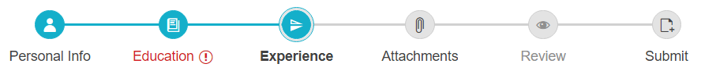

# Steps

The `StepperSteps` property and inner tag exposed by the **RadStepper** control allows you to configure each Step of the Stepper.

You can set the label and the icon of an indicator element and define whether they would be enabled and available for selection or not. You can further set the Step that would be initially selected. Each Step can also be set in error state.

The following example demonstrates how to set the configuration for the Steps. Each **StepperStep** can be customized by setting its various properties.

>caption Figure 1:



The StepperStep elements can be defined declaratively in the markup in the &lt;Steps&gt; tag:

````ASP.NET
<telerik:RadStepper runat="server" ID="RadStepper1" Skin="Silk" RenderMode="Lightweight" Width="750">
    <Steps>
        <telerik:StepperStep Label="Personal Info" Icon="user"/>
        <telerik:StepperStep Label="Education" Error="true" Icon="dictionary-add"/>
        <telerik:StepperStep Label="Experience" Icon="flip-vertical" Selected="true"/>
        <telerik:StepperStep Label="Attachments" Icon="attachment" SuccessIcon="success"/>
        <telerik:StepperStep Label="Review" Icon="preview" Enabled="false"/>
        <telerik:StepperStep Label="Submit" Icon="file-add" />
    </Steps>
</telerik:RadStepper>
````

They can also be added programmatically in the `Steps` collection of the RadStepper control:

````C#
StepperStep step = new StepperStep();
step.Label = "Step 3";
step.Icon = "attachment";
RadStepper1.Steps.Add(step);
````
````VB
Dim step As StepperStep = New StepperStep()
step.Label = "Step 3"
step.Icon = "attachment"
RadStepper1.Steps.Add(step)
````

## Properties

* `Label` - Defines the text of the Step. If set, its value is also applied as a tooltip of the Step.
* `Icon` - Defines the icon to be rendered. Gets a string value corresponding to a class from the built-in font icons. Find more related information in the [Icons]() section.
* `ClientIconTemplate` - Defines The template used to render the icon in the indicator of the Step. Find more related information in the [Icons](#clienticontemplate) section.
* `SuccessIcon` - Defines the icon to be rendered when the step has been completed/selected and it does not have an error. Find more related information in the [Icons]() section.
* `Error` *(bool)* - Defines whether the Step is in Error state (is invalid). By default all steps are valid.
* `Enabled` *(bool)* - Defines whether the Step is enabled. By default all steps are enabled.
* `Selected` *(bool)* - Defines whether the Step is selected. By default the steps are **not** selected.

 
# See Also

 * [Icons]() 
 * [Appearance]() 
 * [Operation Modes]() 
 * [Stepper Overview demo](https://demos.telerik.com/aspnet-ajax/stepper/overview/defaultcs.aspx)


