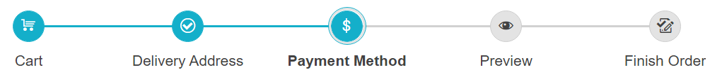

# Getting Started 

The following tutorial demonstrates how you can add the RadStepper control and customize it by setting some of its properties.



1. Add a **ScriptManager** control on a Web Form.

1. Add a **RadStepper** control to the page, and set the desired properties, like:

    * `ShowLabel` - Indicates whether the Steps in the Stepper will render their label element (the text placed below the Step indicator circle). Refer to [Appearance]() article.
    * `ShowIndicator` - Indicates whether the Steps in the Stepper will render their indicator element (the icon or number placed in a circle above the Step label). Refer to [Operation Modes]()
    * `Linear` - Determines whether the Stepper will force the user to follow the Steps sequence or not. Refer to [Operation Modes]()
    * `SelectOnFocus` - Applicable for scenarios when keyboard is used for navigation. Indicates whether the selection will change upon focus change or it will require additional action (Enter or Space bar key press) in order to select the focused step. Check out [Keyboard Navigation]()

1. Define the desired **StepperStep** instances in the &lt;Steps&gt; tag and set their properties:

    * `Icon` - Defines the icons rendered for each StepperStep. Refer to [Icons]() article.
    * `Label` - Defines the label (text) of the Step.
    * `Error` - Defines whether the Step is in error state (is invalid). By default all steps are valid.
    * `SuccessIcon` - Defines the icons rendered for a previously completed/selected Step with no error. Refer to [Icons](#successicon) article.
    * `Enabled` - Defines whether the Step is in error state (is invalid). By default all steps are valid.
    * `Selected`- Defines whether the Step is selected.

Here is the ASPX declaration to achieve the Stepper shown above:

````ASP.NET
<asp:ScriptManager ID="ScriptManager1" runat="server"></asp:ScriptManager>
<telerik:RadStepper runat="server" ID="RadStepper1" Skin="Silk" ShowLabel="true" ShowIndicator="true"
    Linear="true" SelectOnFocus="false" RenderMode="Lightweight" Width="750">
    <Steps>
        <telerik:StepperStep Label="Cart" Icon="shopping-cart"  />
        <telerik:StepperStep Label="Delivery Address" Icon="marker-pin-target" SuccessIcon="success"/>
        <telerik:StepperStep Label="Payment Method" Icon="currency" Selected="true"  />
        <telerik:StepperStep Label="Preview" Icon="preview" />
        <telerik:StepperStep Label="Finish Order" Icon="track-changes-accept"/>
    </Steps>
</telerik:RadStepper>
````

 As a next step, you can check out the [Functionality]() of the RadStepper.


# See Also
 * [Server-side Programming]()
 * [First Steps with UI for ASP.NET AJAX]()
 * [RadStepper online demos](https://demos.telerik.com/aspnet-ajax/stepper/overview/defaultcs.aspx)


