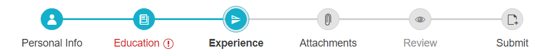
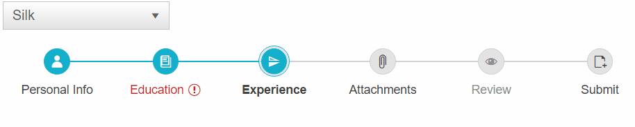

# WebForms Stepper Overview

RadStepper is an intuitive UI component that visualizes progress by displaying a sequence of logical steps. The RadStepper could also be used for navigational purposes.

RadStepper is available as of R2 2022 and it is a server-side WebForms wrapper over the [Kendo UI Stepper for jQuery](https://docs.telerik.com/kendo-ui/controls/navigation/stepper/overview) widget.








## Key Features

* [Built-in Section 508 and WCAG 2.1 АА accessibility, WAI-ARIA and RTL support]()
* [Built-in Icons]()
* [Customizable appearance]()
* [Operation Modes]()
* [Support for Client IconTemplate](#clienticontemplate)
* [Flexible client-side API]()
* [Visual Appeal - shipped with a rich set of skins for easy and consistent styling](#skins)

## Add a RadStepper Control

To add a RadStepper similar to the one shown above follow the steps:

1. Add a **ScriptManager** control on a Web Form.

1. Use the **&lt;telerik:RadStepper&gt;** tag to declare the Stepper.

1. Use the **&lt;Steps&gt;** inner tag to declare each **StepperStep** and set its properties.

````ASP.NET
<asp:ScriptManager ID="ScriptManager1" runat="server"></asp:ScriptManager>
<telerik:RadStepper runat="server" ID="RadStepper1" Skin="Silk" RenderMode="Lightweight" >
    <Steps>
        <telerik:StepperStep Label="Personal Info" Icon="user" />
        <telerik:StepperStep Label="Education" Error="true" Icon="dictionary-add" />
        <telerik:StepperStep Label="Experience" Icon="flip-vertical" />
        <telerik:StepperStep Label="Attachments" Icon="attachment" />
        <telerik:StepperStep Label="Review" Icon="preview" Enabled="false" />
        <telerik:StepperStep Label="Submit" Icon="file-add" />
    </Steps>
</telerik:RadStepper>
````

## Skins

The RadStepper control can be styled by setting a desired built-in skin:

>caption Figure 2:



Find more information about using skins in the [Controlling Visual Appearance]() section.

Go ahead with the [Getting Started]() article to learn more about Stepper Control. Also, you can check out the [RadStepper online demos](https://demos.telerik.com/aspnet-ajax/stepper/overview/defaultcs.aspx) to see it in action.


# See Also 
 * [Telerik UI for ASP.NET AJAX Components](https://www.telerik.com/products/aspnet-ajax.aspx)
 * [Getting Started]()
 * [RadStepper online demos](https://demos.telerik.com/aspnet-ajax/stepper/overview/defaultcs.aspx)
 * [First Steps with UI for ASP.NET AJAX]() 


