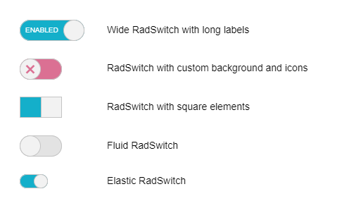
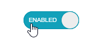
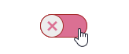
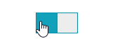

# Controlling Apparance

**RadSwitch** can be easily customized with the help of the standard CSS rules. In this demo you can see how to customize the default styles of the control in order to achieve the following layouts: 

 


## Long Labels

If you want to use long toggle state labels, you can make **RadSwitch** wider by setting its `Width` property:

>caption Wide RadSwitch with long labels



````ASP.NET
<telerik:RadSwitch runat="server" ID="RadSwitch1" Checked="true" Width="92px" AutoPostBack="false">
    <ToggleStates>
        <ToggleStateOff Text="Disabled" />
        <ToggleStateOn Text="Enabled" />
    </ToggleStates>
</telerik:RadSwitch>
````

## Custom Icons

>caption Wide RadSwitch with long labels



````CSS
/*Create RadSwitch with custom icons*/
button.RadSwitch.customIcons .k-switch-container .k-switch-handle, .RadSwitch:hover .k-switch-container .k-switch-handle {
    font-family: "WebComponentsIcons";
    text-align: center;
    color: inherit;
}

button.RadSwitch.customIcons.k-switch-on .k-switch-container .rbHovered,
button.RadSwitch.customIcons.k-switch-on:hover .k-switch-container {
    box-shadow: inset 0 0 0 1px seagreen;
}

button.RadSwitch.customIcons.k-switch-on .k-switch-container,
button.RadSwitch.customIcons.k-switch-on:hover .k-switch-container {
    color: lightgreen;
    background-color: lightgreen;
}

button.RadButton.customIcons.k-switch-on:hover .k-switch-handle,
button.RadButton.customIcons.k-switch-on.k-state-hover .k-switch-handle {
    border-color: seagreen;
}

button.RadSwitch.customIcons.k-switch-off .k-switch-container,
button.RadSwitch.customIcons.k-switch-off:hover .k-switch-container {
    color: palevioletred;
    background-color: palevioletred;
}

    button.RadSwitch.customIcons.k-switch-off .k-switch-container .rbHovered,
    button.RadSwitch.customIcons.k-switch-off:hover .k-switch-container {
        box-shadow: inset 0 0 0 1px brown;
    }

button.RadButton.customIcons.k-switch-off:hover .k-switch-handle,
button.RadButton.customIcons.k-switch-off.k-state-hover .k-switch-handle {
    border-color: brown;
}

.customIcons.k-switch-on .k-switch-handle:before {
    font-size: 2em;
    content: '\e118';
}

.customIcons.k-switch-off .k-switch-handle:before {
    font-size: 2em;
    content: '\e11b';
}
/*********************/
````

## Square RadSwitch

>caption Wide RadSwitch with long labels


````CSS
/*Make RadSwitch square*/
button.RadSwitch.squareSwitch.k-switch,
button.RadSwitch.squareSwitch.k-switch .k-switch-container,
button.RadSwitch.squareSwitch.k-switch .k-switch-handle {
    border-radius: initial;
}
/*********************/
````

## Fluid RadSwitch

````CSS
/*Make RadSwitch fluid*/
.RadButton.RadSwitch.fluidSwitch {
    box-sizing: border-box;
}
/*********************/
````

## Elastic RadSwitch

````CSS
/*Make RadSwitch elastic*/
.RadButton.RadSwitch.elasticSwitch .k-switch-handle {
    width: 2em;
    height: 2em;
}

.RadButton.RadSwitch.k-switch-on.elasticSwitch .k-switch-handle {
    left: calc( 100% - 2em);
}

.RadButton.RadSwitch.elasticSwitch,
.RadButton.RadSwitch.elasticSwitch .k-switch-container {
    width: 4em;
}
/*********************/
````

## See Also

 * [Control the appearance of RadSwitch - demo](https://demos.telerik.com/aspnet-ajax/Switch/Application-Scenarios/Controlling-Appearance/DefaultCS.aspx)

