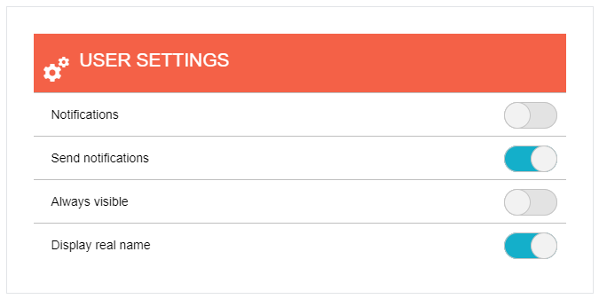

# Switch Overview

The **RadSwitch** control (**Figure 1**) enriches the features, that ASP.NET Switch control has. Additionally, it provides events, supports Commands and numerous [themes](). **RadSwitch** is available as of **R2 2021**.

>caption Figure 1: RadSwitch configuration.



>caption Example 1: A basic example of a RadSwitch setup.

````ASP.NET
        <telerik:RadLabel runat="server" ID="RadLabel1" AssociatedControlID="RadSwitch1" Text="I agree to the Terms & Conditions.">
        </telerik:RadLabel>

        <telerik:RadSwitch ID="RadSwitch1" runat="server" Width="65px">
            <ToggleStates>
                <ToggleStateOn Text="Yes" />
                <ToggleStateOff Text="No" />
            </ToggleStates>
        </telerik:RadSwitch>
````

>note The default value of the `AutoPostBack` property is `true`, which means RadSwitch will POST the page to the server when checked/unchecked.

>note **RadSwitch** does not support a Classic [render mode](). Setting its RenderMode to Classic will default to the Lightweight render mode.

## See Also

 * [RadSwitch Online Demos](https://demos.telerik.com/aspnet-ajax/switch/examples/overview/defaultcs.aspx)

 * [RadSwitch Getting Started]()

 * [RadSwitch Checked State]()

 * [RadSwitch Properties and Events]()
