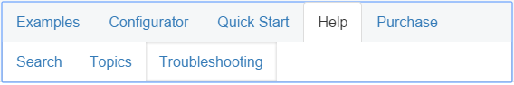

# Keyboard Support


A critical requirement for software accessibility is keyboard support as a complete alternative to pointing devices (mouse, etc.). Keyboard support is comprised of access keys, keyboard navigation, and keyboard shortcuts. RadTabStrip seamlessly switches between mouse and keyboard navigation, just like in desktop applications.

Setting the control's **KeyboardNavigationSettings**, allows you to associate an activation combination (**CommandKey** + **FocusKey**), which moves focus to a particular tab and enables keyboard navigation. When there are multiple tabstrips on a given page, each of them may have a different activation combination.

## Keyboard Navigation Settings

The **KeyboardNavigationSettings** exposes two properties to configure the keyboard combination that sets focus to the control: 

* **FocusKey**: An upper-case letter or number.

* **CommandKey**: [Ctrl] , [Alt] , [Shift] , or any combination of them.

Pressing the keys set to these two properties at the same time places the focus on the TabStrip. The user can then use the arrow keys for navigation. 

>note Note that in some browsers certain keyboard combinations are already occupied and used by the browser itself. 
>



````ASP.NET
<telerik:RadTabStrip ID="RadTabStrip1" runat="server" SelectedIndex="0" RenderMode="Lightweight">
    <KeyboardNavigationSettings CommandKey="Alt" FocusKey="T" />
    <Tabs>
        <telerik:RadTab Text="Examples">
        </telerik:RadTab>
        <telerik:RadTab Text="Configurator">
            <Tabs>
                <telerik:RadTab Text="Default"></telerik:RadTab>
                <telerik:RadTab Text="Test"></telerik:RadTab>
                <telerik:RadTab Text="Final"></telerik:RadTab>
            </Tabs>
        </telerik:RadTab>
        <telerik:RadTab Text="Quick Start">
        </telerik:RadTab>
        <telerik:RadTab Text="Help">
            <Tabs>
                <telerik:RadTab Text="Search"></telerik:RadTab>
                <telerik:RadTab Text="Topics"></telerik:RadTab>
                <telerik:RadTab Text="Troubleshooting"></telerik:RadTab>
            </Tabs>
        </telerik:RadTab>
        <telerik:RadTab Text="Purchase">
        </telerik:RadTab>
    </Tabs>
</telerik:RadTabStrip>
````

## Keyboard Navigation

Once the TabStrip is focused by pressing [Tab] or [CommandKey] + [FocusKey] keyboard navigation is supported by using the arrow keys.

Child menu items are expanded by pressing [Enter].

Use the [ESC] key to go back one level.

