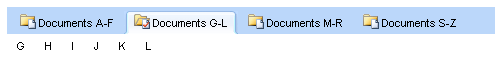

# Adding Images to Tabs

## 

Each **RadTab** has a set of properties you can use to add images to the tab. You can simply add a single image to each tab, or you can add separate images that reflect the state of the tab.

The image appears to the left of the tab's text (unless you are using a [right-to-left orientation](), in which case it appear to the right of the tab's text). By setting the **Text** property to an empty string, you can create tabs that are labelled solely with images.

The following properties let you add images to tabs:

* **ImageUrl** specifies an image that is added to the tab. This image is always used, unless you set one of the other properties to specify an alternate image to use in a specific state.

* **SelectedImageUrl** specifies an image that is used when the tab is selected.

* **HoveredImageUrl** specifies an image that is used when the mouse is over the tab.

* **DisabledImageUrl** specifies an image that is used when the tab is disabled.

To set the image properties at design time, use the [RadTabStrip Item Builder]().

The following example uses the **ImageUrl** and **SelectedImageUrl** properties to create a **RadTabStrip** that adds images to the top-level items:

````ASPNET	 
 <telerik:RadTabStrip RenderMode="Lightweight" ID="RadTabStrip1" runat="server">
	 <Tabs>
	   <telerik:RadTab runat="server"
	     Text=" Documents A-F"
	     ImageUrl="~/Images/Folder.gif"
	     SelectedImageUrl="~/Images/Selected.gif" >
	     <Tabs>
	       <telerik:RadTab runat="server" Text="A" />
	       <telerik:RadTab runat="server" Text="B" />
	       <telerik:RadTab runat="server" Text="C" />
	       <telerik:RadTab runat="server" Text="D" />
	       <telerik:RadTab runat="server" Text="E" />
	       <telerik:RadTab runat="server" Text="F" />
	     </Tabs>
	   </telerik:RadTab>
	   <telerik:RadTab runat="server"
	     Text=" Documents G-L"
	     ImageUrl="~/Images/Folder.gif"
	     SelectedImageUrl="~/Images/Selected.gif">
	     <Tabs>
	       <telerik:RadTab runat="server" Text="G" />
	       <telerik:RadTab runat="server" Text="H" />
	       <telerik:RadTab runat="server" Text="I" />
	       <telerik:RadTab runat="server" Text="J" />
	       <telerik:RadTab runat="server" Text="K" />
	       <telerik:RadTab runat="server" Text="L" />
	     </Tabs>
	   </telerik:RadTab>
	   <telerik:RadTab runat="server"
	     Text=" Documents M-R"
	     ImageUrl="~/Images/Folder.gif"
	     SelectedImageUrl="~/Images/Selected.gif">
	     <Tabs>
	       <telerik:RadTab runat="server" Text="M" />
	       <telerik:RadTab runat="server" Text="N" />
	       <telerik:RadTab runat="server" Text="O" />
	       <telerik:RadTab runat="server" Text="P" />
	       <telerik:RadTab runat="server" Text="Q" />
	       <telerik:RadTab runat="server" Text="R" />
	     </Tabs>
	   </telerik:RadTab>
	   <telerik:RadTab runat="server"
	     Text=" Documents S-Z"
	     ImageUrl="~/Images/Folder.gif"
	     SelectedImageUrl="~/Images/Selected.gif">
	     <Tabs>
	       <telerik:RadTab runat="server" Text="S" />
	       <telerik:RadTab runat="server" Text="T" />
	       <telerik:RadTab runat="server" Text="U" />
	       <telerik:RadTab runat="server" Text="V" />
	       <telerik:RadTab runat="server" Text="W" />
	       <telerik:RadTab runat="server" Text="XYZ" />
	     </Tabs>
	   </telerik:RadTab>
	 </Tabs>
</telerik:RadTabStrip> 	 
````




# See Also

 * [Controlling Appearance]()

 * [Skins]()

 * [Overview]()

 * [Setting the CSS Class of Tabs]()
