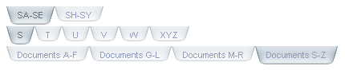
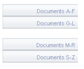
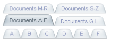
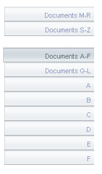
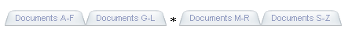
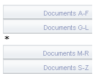

# Controlling Layout

## Orientation

Use the **Orientation** property to control the basic orientation of the tab strip:

* When **Orientation** is "HorizontalTop" (the default), tabs appear to extend from below. When tabs are selected, any child tabs appear in a row below the row containing the parent tab: 

* When **Orientation** "HorizontalBottom", tabs appear to extend from above. When tabs are selected, any child tabs appear in a row above the row containing the parent tab: 

* When **Orientation** is "VerticalLeft", the tabs appear to extend from the right. When tabs are selected, any child tabs appear in a stack below the entire stack of parent tabs: 

* When **Orientation** is "VerticalRight", the tabs appear to extend from the left. When tabs are selected, any child tabs appear in a stack below the entire stack of parent tabs: 

## Breaks

You can break up the layout of tabs in a tab strip into groups by using the **IsBreak** property of the **RadTab** objects in the tab strip.

When you set the **IsBreak** property to **True**, the tab strip adds a break between that tab and the next tab in the tab strip. For tab strips with a horizontal orientation, this means that the remaining tabs appear on another row:

For tab strips with a vertical orientation, a gap appears between the tabs, but they remain in the same stack:

When the tab strip includes tabs with the **IsBreak** property set to **True**, you can use the **ReorderTabsOnSelect** property to ensure that the group that contains the selected tab is always on the bottom. This happens for both horizontal orientations:

and for vertical orientations:

## Separators

You can also break up the layout of the tabs in a tab strip by using separators.Separators are tabs that have the **IsSeparator** property set to **True**. They display their text, but have an appearance that is distinct from the other tabs in the tab strip, and cannot be selected:

In a tab strip with a horizontal orientation, the separator divides the tabs into groups, but leaves them on the same row:

>tip In a horizontal tab strip, if you set the text of a separator to an empty string, it has no visual effect. To create a gap with no text, set the separator **Text** property to "&nbsp;".
>

In a tab strip with a vertical orientation, the separator appears on its own row:

>tip In a vertical grid, if you set the text of a separator to an empty string, the tab strip looks the same as if the previous tab had **IsBreak** set to **True** .
>

You can add a separator with no text to the end of the tabs in a vertical tab strip to provide a gap between the parent tabs and the child tabs:

# See Also

 * [Controlling Appearance]()

 * [Structure]()

 * [Overview]()

 * [RTL support]()
