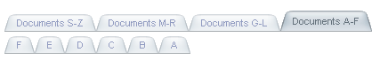

# RTL support


## 

**RadTabStrip** includes support for right-to-left locales using the direction attribute. If you set **dir="tabstrip-rtl"** on the **RadTabStrip** objector to any parent HTML element, **RadTabStrip** reverses the tab order:

````ASPNET	     
<telerik:RadTabStrip RenderMode="Lightweight" ID="RadTabStrip1" runat="server" dir="rtl">
 <Tabs>
   <telerik:RadTab runat="server" Text="Documents A-F">
     <Tabs>
       <telerik:RadTab runat="server" Text="A" />
       <telerik:RadTab runat="server" Text="B" />
       <telerik:RadTab runat="server" Text="C" />
       <telerik:RadTab runat="server" Text="D" />
       <telerik:RadTab runat="server" Text="E" />
       <telerik:RadTab runat="server" Text="F" />
     </Tabs>
   </telerik:RadTab>
   <telerik:RadTab runat="server" Text="Documents G-L">
     <Tabs>
       <telerik:RadTab runat="server" Text="G" />
       <telerik:RadTab runat="server" Text="H" />
       <telerik:RadTab runat="server" Text="I" />
       <telerik:RadTab runat="server" Text="J" />
       <telerik:RadTab runat="server" Text="K" />
       <telerik:RadTab runat="server" Text="L" />
     </Tabs>
   </telerik:RadTab>
   <telerik:RadTab runat="server" Text="Documents M-R">
     <Tabs>
       <telerik:RadTab runat="server" Text="M" />
       <telerik:RadTab runat="server" Text="N" />
       <telerik:RadTab runat="server" Text="O" />
       <telerik:RadTab runat="server" Text="P" />
       <telerik:RadTab runat="server" Text="Q" />
       <telerik:RadTab runat="server" Text="R" />
     </Tabs>
   </telerik:RadTab>
   <telerik:RadTab runat="server" Text="Documents S-Z">
     <Tabs>
       <telerik:RadTab runat="server" Text="S" />
       <telerik:RadTab runat="server" Text="T" />
       <telerik:RadTab runat="server" Text="U" />
       <telerik:RadTab runat="server" Text="V" />
       <telerik:RadTab runat="server" Text="W" />
       <telerik:RadTab runat="server" Text="XYZ" />
     </Tabs>
   </telerik:RadTab>
 </Tabs>
</telerik:RadTabStrip> 				
````

This produces the following tab strip:



# See Also

 * [Controlling Layout]()

 * [Controlling Appearance]()

 * [Setting the CSS Class of Tabs]()

 * [Tutorial Creating A Custom Skin]()

 * [Overview]()
