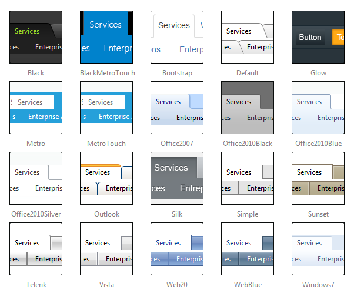

# Skins

__RadTabStrip__ uses __skins__ to control the overall look-and-feel of the tab strip. A skin is a set of images and a CSS stylesheet that can be applied to the tab strip elements (items, images, etc.) and defines their look and feel. To apply a skin to the tab strip, set its __Skin__ property, either using the properties pane or the __RadTabStrip__[Smart Tag]().

__RadTabStrip__ is installed with a number of common skins:

>note The __Hay__ , __Forest__ , __Sitefinity__ and __Transparent__ skins are obsolete and have been removed from the Telerik.Web.UI.Skins.dll assembly as of __Q1 2014__ .You can find more information on the matter in[this blog post](http://blogs.telerik.com/aspnet-ajax/posts/13-04-11/6-telerik-asp.net-ajax-skins-going-obsolete).
>

## Using No Skin

To use the tab strip with no skin, set the __Skin__ property to an empty string and set the __EnableEmbeddedSkins__ property to __False__. When using no skin, you will probably want to use your own [CSS classes]() to adjust the appearance of the tab strip.

## Customizing Skins

You can tweak the existing skins, or create your own. Each skin has two main elements: images and a stylesheet. When creating your own, it is a good idea to start with the stylesheet for an existing skin and alter that. See [Tutorial: Creating a Custom Skin]() for a step-by-step walk through. To use your own skin

1. Add the new CSS file to your project.

1. Drag and drop the CSS file from the Project Explorer onto your Web page.

1. Set the __EnableEmbeddedSkins__ property of the __RadTabStrip__ to __False__.

The stylesheet for a __RadTabStrip__ skin has the name __TabStrip.[SkinName].css__ and can be found in the __...Skins/[SkinName]__ directory. The images are found in the __...Skins/[SkinName]/TabStrip__ directory. For example, the stylesheet for the "Black" skin is called TabStrip.Black.css and is located in the ...Skins/Black directory. The images are found in the ...Skins/Black/TabStrip directory. The images are referenced by name from within the stylesheet.

For more information on the CSS File structure, see [Understanding the Skin CSS File]().

# See Also

 * [Setting the CSS Class of Tabs]()

 * [Adding Images to Tabs]()

 * [Controlling Appearance]()
