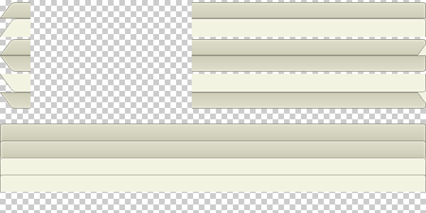

# Sprite Guide

## Overview

RadTabStrip for ASP.NET AJAX introduces a great client-side performance gains by using [CSS sprites](http://alistapart.com/articles/sprites) - a technique that [reduces the count of http requests](http://developer.yahoo.com/performance/rules.html#num_http), sent to the server. This article aims to clarify how the images are organized within the sprite file.

## How-to-sprite

The Hay skin is used in this article, because it features the "Overlapping tabs" functionality and thus, offers the most complicated sprite in the RadTabStrip skins. Below is the sprite file for the skin.

The overlapping nature of the skin requires only the third and sixth image rows that contain the overlaps of the tabs. The first three rows handle the "HorizontalTop" orientation, while rows 4-6 handle "HorizontalBottom"; the last four rows are used in the two vertical orientations of the RadTabStrip.

The transparent space between the left border of each row and the center of the image is added to allow the usage of one sprite file (instead of two) by applying the ["CSS sliding doors" technique](http://www.alistapart.com/articles/slidingdoors/). Below is an image that shows how the CSS backgrounds are applied within the HTML structure.

## Limitations

The sprite file makes it impossible to have tabs with unlimited width - the maximum width of a tab is half the size of the sprite. If wider tabs are needed, the options are to make the sprite wider or to use several images (thus, allowing repeatable backgrounds).
