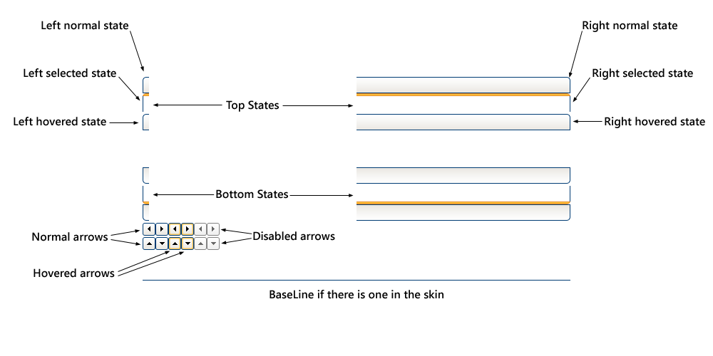

# Tutorial Creating a Custom Skin Using Sprite 


The following tutorial demonstrates creating a custom **RadTabStrip** skin, using the default skin as a base. This new skin will take the appearance of the tab strip from its default look:


See [Sprite Guide]() for more information on RadTabStrip sprite.

## Prepare the Project

* Drag a **RadTabStrip** from the toolbox onto a new AJAX-enabled application Web form.

* Use the **RadTabStrip Item Builder** to add tabs to the tab strip, or add them in the HTML markup. Include two levels of tabs, and include a disabled tab:

````ASPNET	 
<telerik:RadTabStrip ID="RadTabStrip1" runat="server" SelectedIndex="0">
    <Tabs>
        <telerik:RadTab runat="server" Text="Root RadTab1" Selected="True">
            <Tabs>
                <telerik:RadTab runat="server" Text="Child RadTab 1">
                </telerik:RadTab>
                <telerik:RadTab runat="server" Text="Child RadTab 2">
                </telerik:RadTab>
            </Tabs>
        </telerik:RadTab>
        <telerik:RadTab runat="server" Text="Root RadTab2">
        </telerik:RadTab>
        <telerik:RadTab runat="server" Text="Root RadTab3">
        </telerik:RadTab>
        <telerik:RadTab runat="server" Text="Root RadTab4">
        </telerik:RadTab>
    </Tabs>
</telerik:RadTabStrip>	 
````


* Copy the default **RadTabStrip** skin files from the installation directory to your project; copy both the \TabStrip directory that contains the images for this skin and the TabStrip.Default.css file that defines the skin styles.

>note The file path will typically be similar to this example: *\Program Files\Telerik\<Your Version of RadControls for ASPNET>\Skins\Default.* 
>


* In the Solution Explorer, rename "TabStrip.Default.css" to "TabStrip.Green.css". The Solution Explorer should now look something like the following:

* Open TabStrip.Green.css and replace all instances of _Default with _Green. Then save the file:

* Drag the "TabStrip.Green.Css" file from the Solution Explorer onto your Web page. This automatically adds a reference to the page "<head>" tag as a "<link>" to the new stylesheet:

* Set the **EnableEmbeddedSkins** property of the **RadTabStrip** control to **False**.

* Change the **Skin** property of your **RadTabStrip** control to "Green".

* Run the application. The new "Green" skin looks just like the Default skin:

## Applying the Sprite

Instead of just two or three images being combined into one, you can combine an unlimited number of images into one called Sprite. You can read more about [Sprite Guide]()

In order to modify the existing sprite according to some specific requirements such as different rounded corners or background-color applied to the rounded corners of the RadTabStrip you will need to change the sprite image as described below:

1. Locate the already existing sprite of the RadTabStrip -**TabStripStates.png**(using the default installation it should be in C:\Program Files (x86)\Telerik\RadControls for ASP.NET AJAX Q3 2010\Skins\Default\TabStrip ).

1. Modify the sprite image of the **RadTabStrip** as desired – changing the shape of the corners, the background-color, the color of the different states of the tabs etc.

1. Save the Sprite with the same name - **TabStripStates.png**.

1. Simply replace the new image with the old one in the \TabStrip folder.

For more information about Sprites, see:

* [CSS Image Sprites](http://www.w3schools.com/css/css_image_sprites.asp)

# See Also

 * [Sprite Guide]()

 * [Skins]()

 * [Setting the CSS Class of Tabs]()
