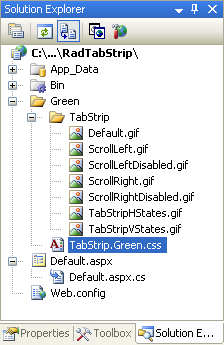
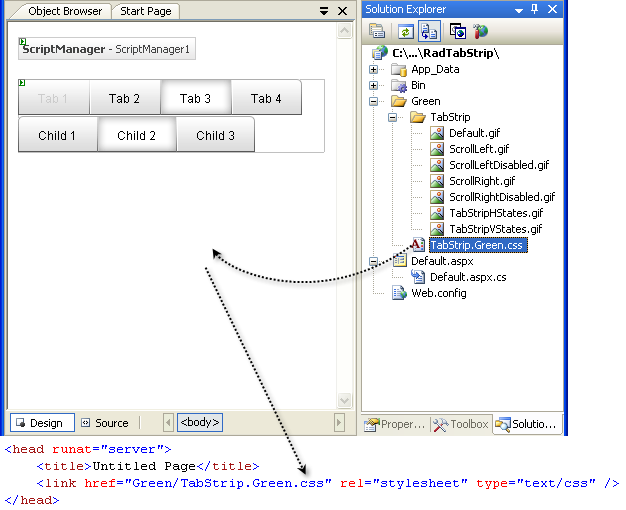

# Tutorial Creating A Custom Skin


The following tutorial demonstrates creating a custom __RadTabStrip__ skin, using the default skin as a base. This new skin will take the appearance of the tab strip from its default look:


to the following:


See [Understanding the Skin CSS File]() for more information on specific CSS file properties.

## Prepare the Project

1. Drag a __RadTabStrip__ from the toolbox onto a new AJAX-enabled application Web form.

1. Use the __RadTabStrip Item Builder__ to add tabs to the tab strip, or add them in the HTML markup. Include two levels of tabs, and include a disabled tab:

````ASPNET
	 
	 <telerik:RadTabStrip ID="RadTabStrip1" runat="server" SelectedIndex="0">
	            <Tabs>
	                <telerik:RadTab runat="server" Text="Root RadTab1" Selected="True">
	                    <Tabs>
	                        <telerik:RadTab runat="server" Text="Child RadTab 1">
	                        </telerik:RadTab>
	                        <telerik:RadTab runat="server" Text="Child RadTab 2">
	                        </telerik:RadTab>
	                    </Tabs>
	                </telerik:RadTab>
	                <telerik:RadTab runat="server" Text="Root RadTab2">
	                </telerik:RadTab>
	                <telerik:RadTab runat="server" Text="Root RadTab3">
	                </telerik:RadTab>
	                <telerik:RadTab runat="server" Text="Root RadTab4">
	                </telerik:RadTab>
	            </Tabs>
	        </telerik:RadTabStrip>
	 
````


1. In the Solution Explorer, create a new "Green" directory in your project.

1. Copy the default __RadTabStrip__ skin files from the installation directory to the "Green" directory; copy both the \TabStrip directory that contains the images for this skin and the TabStrip.Default.css file that defines the skin styles.

>note The file path will typically be similar to this example: *\Program Files\Telerik\<Your Version of RadControls for ASPNET>\Skins\Default.* 
>


1. In the Solution Explorer, rename "TabStrip.Default.css" to "TabStrip.Green.css". The Solution Explorer should now look something like the following:

1. Open TabStrip.Green.css and replace all instances of _Default with _Green. Then save the file:

1. Drag the "TabStrip.Green.Css" file from the Solution Explorer onto your Web page. This automatically adds a reference to the page "<head>" tag as a "<link>" to the new stylesheet:

1. Set the __EnableEmbeddedSkins__ property of the __RadTabStrip__ control to __False__.

1. Change the __Skin__ property of your __RadTabStrip__ control to "Green".

1. Run the application. The new "Green" skin looks just like the Default skin:

## Modifying the CSS file

1. The first selector in the CSS file sets the "color" attribute for the __.rtsLI__ and __.rtsLink__ classes. These are the classes applied to the LI and A elements that represent a rendered tab. (Separator tabs get the __.rtsLI__ class on an LI element, but have no A element with the __.rtsLink__ class). Change the color to green, so that the text labels on tabs use a green font :

````ASPNET
	
	.RadTabStrip_Green .rtsLI,
	.RadTabStrip_Green .rtsLink
	{
	  color: Green;
	} 
	
````


1. Locate the selector for the __.rtsIn__ class. This class is applied to a SPAN that wraps the text and images that label the tabs. Change the padding attribute from "9px 20px 7px" to "0 5px 5px" to reduce the size of the tabs:

````ASPNET
	     
	.RadTabStrip_Green .rtsIn
	{
	  font: 12px/20px arial,sans-serif;
	  padding: 0 5px 5px;
	} 
				
````


1. Locate the selector for the __.rtsDisabled__ class (it is qualified by the __.RadTabStrip_Green__, __.RadTabStripLeft_Green__, __.RadTabStripRight_Green__, __.RadTabStripBottom_Green__, and __.RadTabStrip_Green_disabled__ classes for additional specificity). Change the color attribute from "#ccc" to "#bcb", to give the disabled text a greener font:

````ASPNET
	
	.RadTabStrip_Green .rtsDisabled,
	.RadTabStripLeft_Green .rtsDisabled,
	.RadTabStripRight_Green .rtsDisabled,
	.RadTabStripBottom_Green .rtsDisabled,
	.RadTabStrip_Green_disabled .rtsDisabled
	{
	color: #bcb;
	cursor: default;
	} 
	
````


1. Locate the group of selectors that all begin with __.RadTabStripTop__. These are for tab strips with a "HorizontalTop" orientation. Within this group, locate the selector for __.rtsLink__ and replace the background attribute (which loads an image) with "#aff1a1":

````ASPNET
	     
		.RadTabStripTop_Green .rtsLink { background: #aff1a1; }
				
````


1. In the same group, delete the selectors __.rtsFirst .rtsLink__, __.rtsLast .rtsLink__, and __.rtsLast .rtsOut__. These classes provide the shape of the first and last tabs in the tab strip (with the .rtsOut class to handle the interior portion of the tab).

1. Locate the remaining selectors that set a background image for the tabs. These are __.rtsSelected__, __.rtsSelected .rtsOut__, __.rtsFirst .rtsSelected__, __.rtsLast .rtsSelected__, and __.rtsLast .rtsSelected .rtsOut__. These apply to selected tabs, with qualifiers for the first and last tabs, and with the __.rtsOut__ class added for the portion of the tab that contains images and text. Change the background attribute so that instead of a transparent color, it uses "#aff1a1":

````ASPNET
	.RadTabStripTop_Green .rtsSelected { background: #aff1a1 url('TabStrip/TabStripHStates.gif') no-repeat 0 -72px; }
	.RadTabStripTop_Green .rtsSelected .rtsOut { background: #aff1a1 url('TabStrip/TabStripHStates.gif') no-repeat 100% -72px; }
	.RadTabStripTop_Green .rtsFirst .rtsSelected { background: #aff1a1 url('TabStrip/TabStripHStates.gif') no-repeat 0 -180px; }
	.RadTabStripTop_Green .rtsLast .rtsSelected { background: #aff1a1 url('TabStrip/TabStripHStates.gif') no-repeat 100% -180px; }
	.RadTabStripTop_Green .rtsLast .rtsSelected .rtsOut { background: #aff1a1 url('TabStrip/TabStripHStates.gif') no-repeat 0 -72px; } 
````


1. Locate the group of selectors that all begin with __.RadTabStripTop__. These are for tab strips with a "HorizontalTop" orientation. Within this group, locate the selector for __.rtsLink__ and replace the background attribute (which loads an image) with "#aff1a1":

````ASPNET
	     
		.RadTabStripTop_Green .rtsLink { background: #aff1a1; }
				
````


1. The remaining selectors in the CSS file handle the appearance of the tabs for tab strips with other orientations. They work similarly to the group you just changed. If you were creating a real skin, you would want to make analagous changes to these rules as well, but for the purposes of this tutorial, we will skip them.

1. Run the application. The tab strip should now look as follows:

For more information about Cascading Style Sheets, see

* [World Wide Web Consortium CSS specifications](http://www.w3.org/Style/CSS/)

* [W3 Schools CSS tutorial](http://www.w3schools.com/css/default.asp)

* [Guide to Cascading Style Sheets](http://www.htmlhelp.com/reference/css/)

# See Also

 * [Skins]()

 * [Setting the CSS Class of Tabs]()
