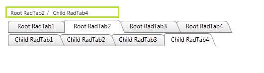

# Implementing Show Path and BreadCrumb


## 

__Q:__ How can I use the SiteMap as a BreadCrumb with a RadTabStrip? Meaning when clicking on a Root Tab or a Child Tab will show the current path where the user has clicked as demonstrated in the image below:



__A:__ Just like with the RadMenu, using the RadTabStrip one easily can implement the BreadCrumb functionality using the code below:

````ASPNET
			<telerik:RadSiteMap ID="BreadCrumbSiteMap" runat="server" DataTextField="Text" DataNavigateUrlField="NavigateUrl">
				<DefaultLevelSettings ListLayout-RepeatDirection="Horizontal" SeparatorText="/" Layout="Flow" />
			</telerik:RadSiteMap>
			<telerik:RadTabStrip ID="RadTabStrip1" runat="server">
				<Tabs>
					<telerik:RadTab runat="server" Text="Root RadTab1" NavigateUrl="BreadCrumbMenuTabstrip.aspx?Page=Root RadTab1">
					</telerik:RadTab>
					<telerik:RadTab runat="server" Text="Root RadTab2" Selected="true" NavigateUrl="BreadCrumbMenuTabstrip.aspx?Page=Root RadTab2">
						<Tabs>
							<telerik:RadTab runat="server" Text="Child RadTab1" NavigateUrl="BreadCrumbMenuTabstrip.aspx?Page=Child RadTab1">
							</telerik:RadTab>
							<telerik:RadTab runat="server" Selected="true" Text="Child RadTab2" NavigateUrl="BreadCrumbMenuTabstrip.aspx?Page=Child RadTab2">
							</telerik:RadTab>
							<telerik:RadTab runat="server" Text="Child RadTab3" NavigateUrl="BreadCrumbMenuTabstrip.aspx?Page=Child RadTab3">
							</telerik:RadTab>
							<telerik:RadTab runat="server" Text="Child RadTab4" NavigateUrl="BreadCrumbMenuTabstrip.aspx?Page=Child RadTab4">
							</telerik:RadTab>
						</Tabs>
					</telerik:RadTab>
					<telerik:RadTab runat="server" Text="Root RadTab3" NavigateUrl="BreadCrumbMenuTabstrip.aspx?Page=Root RadTab3">
					</telerik:RadTab>
					<telerik:RadTab runat="server" Text="Root RadTab4" NavigateUrl="BreadCrumbMenuTabstrip.aspx?Page=Root RadTab4">
					</telerik:RadTab>
				</Tabs>
			</telerik:RadTabStrip>
````


>tabbedCode

````C#
	
		protected void Page_Load(object sender, EventArgs e)
		{
			RadTab currentTab = RadTabStrip1.FindTabByUrl(Request.Url.PathAndQuery);
			if (currentTab != null)
			{
				DataBindBreadCrumbSiteMap(currentTab);
				TabHighLightTab(currentTab);
			}
			else { }
		}
	
		private void TabHighLightTab(RadTab tab)
		{
			tab.Selected = true;
			if (tab.Owner.GetType().FullName == "Telerik.Web.UI.RadTab")
			{
				TabHighLightTab((tab.Owner as RadTab));
			}
		}
	
		private void DataBindBreadCrumbSiteMap(RadTab currentTab)
		{
			List<RadTab> breadCrumbPath = new List<RadTab>();
			while (currentTab != null)
			{
				breadCrumbPath.Insert(0, currentTab);
				currentTab = currentTab.Owner as RadTab;
			}
			BreadCrumbSiteMap.DataSource = breadCrumbPath;
			BreadCrumbSiteMap.DataBind();
		}
	
	
````
````VB.NET
	
		Protected Sub Page_Load(ByVal sender As Object, ByVal e As EventArgs) Handles Me.Load
	
			Dim currentTab As RadTab = RadTabStrip1.FindTabByUrl(Request.Url.PathAndQuery)
			If currentTab IsNot Nothing Then
				DataBindBreadCrumbSiteMap(currentTab)
				TabHighLightTab(currentTab)
			Else
			End If
		End Sub
	
		Private Sub TabHighLightTab(ByVal tab As RadTab)
			tab.Selected = True
			If tab.Owner.[GetType]().FullName = "Telerik.Web.UI.RadTab" Then
				TabHighLightTab(TryCast(tab.Owner, RadTab))
			End If
		End Sub
	
		Private Sub DataBindBreadCrumbSiteMap(ByVal currentTab As RadTab)
			Dim breadCrumbPath As New List(Of RadTab)()
			While currentTab IsNot Nothing
				breadCrumbPath.Insert(0, currentTab)
				currentTab = TryCast(currentTab.Owner, RadTab)
			End While
			BreadCrumbSiteMap.DataSource = breadCrumbPath
			BreadCrumbSiteMap.DataBind()
		End Sub
				
````
>end
