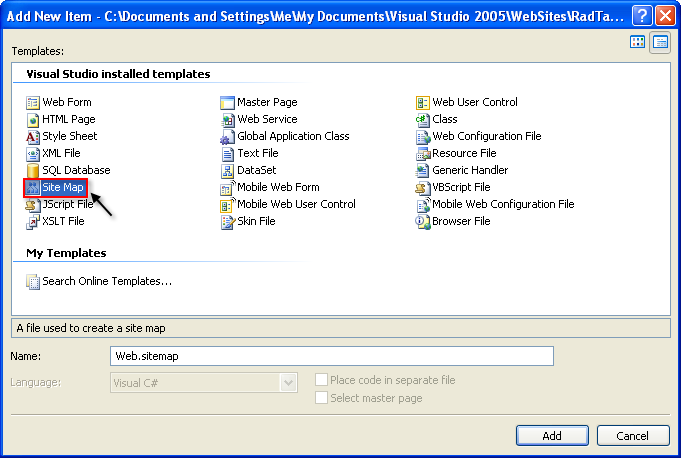
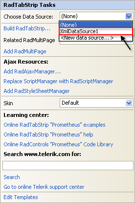

# Binding to Hierarchical DataSource Components


Some data sources are inherently hierarchical. These include **SiteMapDataSource** and **XmlDataSource**. When data-bound to these types of data sources, **RadTabStrip** automatically creates the tab hierarchy. There is no need to use the **DataFieldID** and **DataFieldParentID** properties.

## Binding to SiteMapDataSource

When binding to **SiteMapDataSource**, there is no need to set any properties to map fields from the data source to properties of the tabs. This is because site maps have a strictly defined structure.

The **SiteMapDataSource** control defines the structure of your Web site. You can have only one site map per site. By default the **SiteMapDataSource** control uses the default Site Navigation Provider. This provider lets you define the structure of your site, separating the real page structure of the site on one hand, and the UI presentation on the other.

The default site navigation provider is XML-based. It should stay in the root level of your project and should be named **web.sitemap**. Using the Site Navigation API provided in ASP.NET v2.0, you can write your own Site Navigation Provider and expose the navigation information from any back-end system, if needed.

## Setting the SiteMapDataSource control

Before adding the **SiteMapDataSource** control to your page, you need to add the Site Navigation Provider.

1. In the Solution Explorer, choose **Add New Item**... In the templates dialog, select **Site Map**:

1. Click the Add button. Visual Studio generates the web.sitemap file with the initial code:

````XML	
<?xml version="1.0" encoding= "utf-8" ?>
<siteMap xmlns="http://schemas.microsoft.com/AspNet/SiteMap-File-1.0" >
  <siteMapNode url="" title=""  description="">
       <siteMapNode url="" title=""  description="" />
       <siteMapNode url="" title=""  description="" />
  </siteMapNode>
</siteMap> 	
````

1. Populate the Web.sitemap file. Here is an example:

````XML
<?xml version="1.0" encoding= "utf-8" ?>
<siteMap xmlns="http://schemas.microsoft.com/AspNet/SiteMap-File-1.0" >
<siteMapNode url="http://www.telerik.com" title="Telerik" description="Telerik home page">
<siteMapNode url="http://www.telerik.com/radcontrols" title="Telerik RadControls for ASP.NET" description ="Telerik RadControls for ASP.NET" >
<siteMapNode url="http://www.telerik.com/radeditor" title="Telerik RadEditor" description="Telerik RadEditor control"/>
</siteMapNode>
<siteMapNode url="http://www.telerik.com/radnavigation" title="Telerik RadNavigation controls" description ="Telerik RadNavigation controls" />
</siteMapNode>
</siteMap> 	
````

>caution The url must be unique for each node. Avoid using backslashes (\) for your URLs. Backslashes may cause problems with some browsers. Instead, we use the slash character (/).
>


1. Drag a **SiteMapDataSource** instance from the Toolbox to your Web page.

1. Set the **ShowStartingNode** property of the **SiteMapDataSource** component to **False**. This allows you to use multiple tabs at the root level.

## Binding the SiteMapDataSource to Telerik RadTabStrip

1. From the **RadTabStrip** property pane, set the **DataSourceID** to the **ID** of the **SiteMapDataSource** control.

1. Each **siteMapNode** has three attributes which are mapped automatically to the respective properties:

* **url** - Maps to the **NavigateUrl** property.The path can be either relative (using the ~/), or absolute.

* **title** - Maps to the **Text** property.

* **description** - Maps to the **ToolTip** property.

1. To set additional properties or overwrite already populated fields, use the **TabDataBound** event. The example below overwrites the **TooTip** property:


````C#	
void RadTabStrip1_TabDataBound( object sender, RadTabStripEventArgs e)
{
	e.Tab.ToolTip = "Read more about" + (string)DataBinder.Eval(e.Tab.DataItem, "title");	 
} 		
````
````VB.NET
Private Sub RadTabStrip1_TabDataBound(ByVal sender As Object, ByVal e As RadTabStripEventArgs) Handles RadTabStrip1.TabDataBound
    e.Tab.ToolTip = "Read more about" + DirectCast(DataBinder.Eval(e.Tab.DataItem, "title), String)
End Sub 	
````


## Binding to XmlDataSource

When binding to an **XmlDataSource**, **RadTabStrip** creates the tab hierarchy automatically. However, unlike **SiteMapDataSource**, properties such as **Text** and **NavigateUrl** are **not** automatically populated.

Consider the following example:

1. Add the following xml file in the App_Data folder:

````XML	 
<?xml version="1.0" encoding="utf-8" ?>
<Items Text="">
 <Item Text="European cities" Url="" >  
   <Item Text="Sofia" Url="http://en.wikipedia.org/wiki/Sofia" />
   <Item Text="Berlin" Url="http://en.wikipedia.org/wiki/Berlin" />
   <Item Text="Paris" Url="http://en.wikipedia.org/wiki/Paris" />
</Item>
<Item Text="North American cities" Url="">
  <Item Text="Boston" Url="http://en.wikipedia.org/wiki/Boston" />
  <Item Text="San Francisco" Url="http://en.wikipedia.org/wiki/San_Francisco" />
  <Item Text="Seattle" Url="http://en.wikipedia.org/wiki/Seattle" />
  <Item Text="Toronto" Url="http://en.wikipedia.org/wiki/Toronto" />
</Item>
<Item Text="South American cities" Url="">
  <Item Text="Rio de Janeiro" Url="http://en.wikipedia.org/wiki/Rio_De_Janeiro" />
  <Item Text="Buenos Aires" Url="http://en.wikipedia.org/wiki/Buenos_aires" />
</Item>
<Item Text="Asian cities" Url="">
  <Item Text="Tokyo" Url="http://en.wikipedia.org/wiki/Tokyo" />
  <Item Text="Seul" Url="http://en.wikipedia.org/wiki/Seul" />
  <Item Text="Beijing" Url="http://en.wikipedia.org/wiki/Beijing" />
  <Item Text="Tehran" Url="http://en.wikipedia.org/wiki/Teheran" />
</Item>
<Item Text="African cities" Url="">
  <Item Text="Kano" Url="http://en.wikipedia.org/wiki/Kano" />
  <Item Text="Johannesburg" Url="http://en.wikipedia.org/wiki/Johannesburg" />
  <Item Text="BeninCity" Url="http://en.wikipedia.org/wiki/Benin" />
</Item>
</Items> 	 
````

1. Drag an instance of **XmlDataSource** onto your Web form and configure the control:

1. Set the Data file to the XML file you just added.

1. Set the XPath expression to "/Items/Item". This removes the starting node of the XML file so that you can have multiple root-level tabs. 


1. Set the **DataSourceID** of your RadTabStrip to the ID of the XmlDataSource or choose the XMLDataSource from the smart tag: 


1. Map the **Text**, **Value** and **NavigateUrl** fields by setting the **DataTextField**, **DataValueField** and **DataNavigateUrlField** properties: 


>tip This example has no separate field for value, so it uses the Text field for the **Value** property, for illustrative purposes.
>


1. As with the **SiteMapDataSource** example above, you can map additional properties using the **[TabDataBound event]()**:


````C#
void RadTabStrip1_TabDataBound( object sender, RadTabStripEventArgs e)
{
  if (e.Tab.Level > 0)//set tooltip only for child tabs
  {          
     XmlElement element = (XmlElement)e.Tab.DataItem;
     e.Tab.ToolTip = "Read more about " + element.Attributes["Text"].Value;
  }  
} 			
````
````VB.NET	
Private Sub RadTabStrip1_TabDataBound(ByVal sender As Object, ByVal e As RadTabStripEventArgs) Handles RadTabStrip1.TabDataBound
    If e.Tab.Level > 0 Then 'set tooltip only for child tabs
       Dim element As XmlElement = DirectCast(e.Tab.DataItem, XmlElement)
      e.Tab.ToolTip = "Read more about " + element.Attributes("Text").Value
   End If
End Sub 
````

# See Also

 * [Overview]()

 * [Using DataBindings]()

 * [Binding to Table-Based DataSource Components]()

 * [Binding to DataTable]()

 * [Binding to Object-Based Data Sources]()
