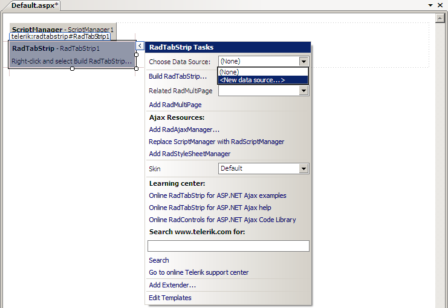
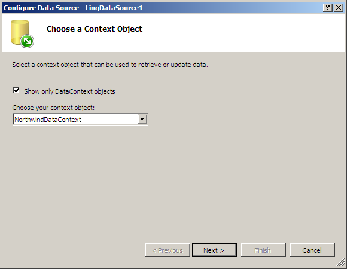
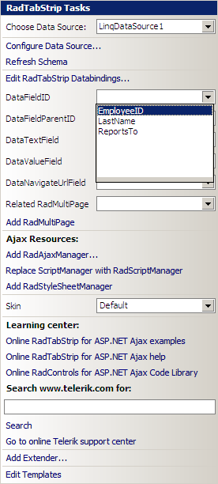

# Binding to LinqDataSource

## 

Since the Q2 2008 SP1 release **RadTabStrip** supports hierarchical data binding to the [LinqDataSource](http://msdn.microsoft.com/en-us/library/bb547113.aspx) control. This article shows how to do this in Design Time:

1. Create a new Web Site in Visual Studio 2008 and copy the **Northwind.mdf** database in your **App_Data** folder.

1. Add a new **"Linq to SQL Classes"** item named **"Northwind.dbml"**:

1. Open **Northwind.dbml** in design mode and drag the **Employees** table from Server Explorer. The **Employees** table is self referencing and suites perfectly for this example:

1. Open **Default.aspx** in design mode and drag a new **RadTabStrip** instance.

1. Open the smart tag and select **"New data source"**:

1. Choose **"LinqDataSource"** from the "Data Source Configuration Wizard":

1. Configure the newly created data source to use the **NorhtwindDataContext** object:

1. Select the **"EmployeeID"**, **"LastName"** and **"ReportsTo"** columns from the "Configure Data Source" dialog:

1. Click **"Finish"** and open the **RadTabStrip** smart tag to complete the configuration.

1. Select **"EmployeeID"** for the **DataFieldID** property, **"ReportsTo"** for the **DataFieldParentID** property and **"LastName"** for the **DataTextField** property:

1. Save your page and run the web site. You should see a page with the following **RadTabStrip**:

# See Also

 * [Overview]()
