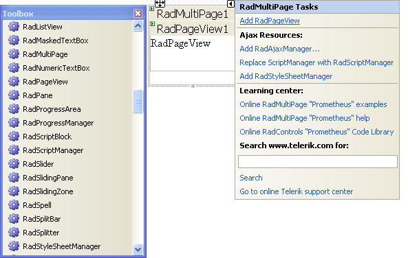

# Design Time Support for RadMultiPage

## 

To create a **RadMultiPage** control at design time:

1. Drag and drop an instance of **RadMultiPage** from the toolbox onto the web form.

1. To add PageViews, do one of the following:

1. Drag and drop instances of the **RadPageView** control from the toolbox onto the multi-page.

1. Click the **Add RadPageView** link in the **RadMultiPage** [Smart Tag]().




You can also declare the **RadPageView** controls declaratively in the ASPX file:

````ASPNET
<telerik:RadMultiPage ID="RadMultiPage1" runat="server" >
 <telerik:RadPageView ID="RadPageView1" runat="server">
   ...
 </telerik:RadPageView>
 <telerik:RadPageView ID="RadPageView2" runat="server">
   ...
 </telerik:RadPageView>
 <telerik:RadPageView ID="RadPageView3" runat="server">
   ...
 </telerik:RadPageView>
 <telerik:RadPageView ID="RadPageView4" runat="server">
   ...
 </telerik:RadPageView>
</telerik:RadMultiPage> 
````


