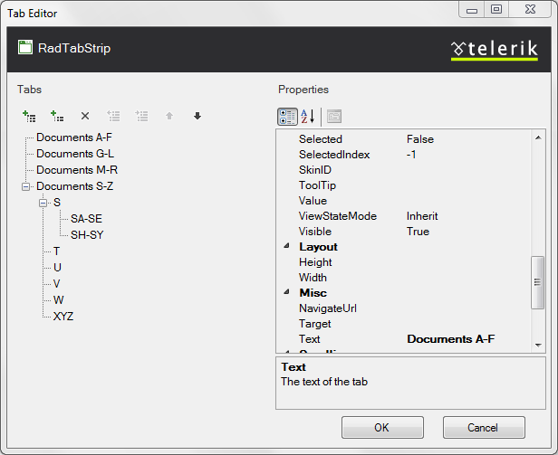
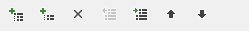
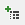
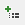
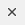
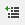
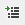
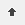
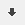

# RadTabStrip Item Builder

The **RadTabStrip Item Builder** lets you populate your tab strip with a hierarchy of items that do not come from a separate data source. There are two ways to bring up the RadTabStrip Item Builder:

* From the **RadTabStrip** [Smart Tag](), click on the **Build RadTabStrip** link.

* Right-click on the **RadTabStrip** component and select **Build RadTabStrip** from its context menu.

>tip The **Build RadTabStrip** option is not available in the Smart Tag or context menu if the **RadTabStrip** control is bound to a data source.
>

## RadTabStrip Item Builder

The **RadTabStrip Item builder** lets you add, rearrange, configure, and delete tabs. These actions are initiated using the tool bar at the upper left of the Item builder:

The following table describes the controls in the tool bar:

>caption  

| Button | Function |
| ------ | ------ |
||Adds a root item to the tab strip in the next available position. Root items are the top-level items (tabs with no parent tab).|
||Adds a child item to the currently selected tab. The child can belong to either a root item or another child item.|
||Deletes the currently selected tab. When you delete a tab, its child items are deleted as well.|
||Moves the currently selected tab up a level, making it a sibling to its parent item (following the parent item).|
||Moves the currently selected tab down a level, making it the child of its previous sibling.|
||Moves the currently selected tab backward in its current list of siblings, so that it precedes the previous sibling.|
||Moves the currently selected tab forward in its current list of siblings, so that it follows the next sibling.|

When a tab (either a root item or a child item) is selected, the properties pane on the right of the **RadTabStrip Item Builder** lets you configure the item by setting its properties. For each item,

* **Text** is the text that appears on the tab.

* **ToolTip** is the text of a tooltip that appears when the user hovers the mouse over the tab.

* **Value** is a string value that you can associate with the tab for use when programming the tab strip behavior.

* **IsSeparator** specifies whether the tab acts as a separator.

* **IsBreak** specifies whether the tab strip displays the next tab in the collection in another row.

* **Enabled** controls whether the tab is initially enabled or disabled.

* **Selected** controls whether the tab is initially selected.

* **SelectedIndex** specifies which child item of the tab is initially selected.

* **NavigateUrl** and **Target** cause the tab to automatically launch another Web page (specified by **NavigateUrl**) in the window specified by **Target**. If the **Target** property is not set, the new Web page uses the current browser window.

* **PostBack** specifies whether the tab causes a postback when the user selects it.

* **ScrollChildren**, **PerTabScrolling**, **ScrollButtonsPosition**, and **ScrollPosition** specify how the tab [scrolls its child items]() when there is not enough room to display them all.

* **CssClass**, **SelectedCssClass**, **DisabledCssClass**, **HoveredCssClass**, and **ChildGroupCssClass** [control the appearance of the tab]() when it is in its normal state, selected, disabled, under the mouse, and the appearance of its group of child items, respectively.

* **ImageUrl**, **SelectedImageUrl**, **DisabledImageUrl**, and **HoveredImageUrl** let you [specify an image]() that appears on the left of the tab text when it is in its normal state, selected, disabled, and when the mouse hovers over it, respectively.
