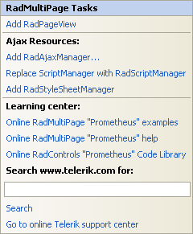

# Smart Tag

The **RadTabStrip** and **RadMultiPage** Smart Tags allow easy access to frequently needed tasks. You can display the Smart Tag by right clicking on a **RadTabStrip** or **RadMultiPage** control in the design window, and choosing **Show Smart Tag**.

## Unbound RadTabStrip Smart Tag

When **RadTabStrip** is unbound, the Smart Tag looks like the following:

Using the unbound **RadTabStrip** Smart Tag you can perform the following:

## RadTabStrip Tasks

* **Choose Data Source** lets you bind the tab strip declaratively by selecting a data source from a drop-down list of all available data source components. If you select **&lt;New Data Source...&gt;** the standard Windows [Data Source Configuration Wizard](https://msdn2.microsoft.com/en-us/library/ms247282(VS.80).aspx) appears, where you can create and configure a data source component.

* **Build RadTabStrip...** opens the [RadTabStrip Item Builder](), where you can create and configure statically-defined items for your tab strip.

* **Related RadMultiPage** [attaches a RadMultiPage control]() that is already on the page to the **RadTabStrip**. Choose a **RadMultiPage** control from the drop down list.

* **AddRadMultiPage** creates a new **RadMultiPage** control on the Web page and attaches it to the **RadTabStrip**.

## Ajax Resources

* **Add RadAjaxManager...** adds a **RadAjaxManager** component to your Web page, and displays the **r.a.d.ajax Property Builder** where you can configure it.

* **Replace ScriptManager with RadScriptManager** replaces the default **ScriptManager** component that is added for AJAX-enabled Web sites with **RadScriptManager**.

* Add **RadStyleSheetManager** adds a **RadStyleSheetManager** to your Web page.

## Skin

The **Skin** drop-down lets you preview the built-in [skins]() and select one for your tab strip.

## Learning Center

Links navigate you directly to **RadTabStrip** examples, help, or code library. You can also search the Telerik web site for a given string.

## Edit Templates

Clicking the **Edit Templates** link brings up a [template design surface]() where you can create or edit the [templates]() your **RadTabStrip** uses.

## Bound RadTabStrip Smart Tag

When **RadTabStrip** is bound to a data source, the Smart Tag looks like the following:

Using the bound **RadTabStrip** Smart Tag you can perform the following:

## RadTabStrip Tasks

* **Choose Data Source** lets you change the declarative menu binding by selecting a data source from a drop-down list of all available data source components. If you select "**<New Data Source...>**" the standard Windows [Data Source Configuration Wizard](https://msdn2.microsoft.com/en-us/library/ms247282(VS.80).aspx) appears, where you can create and configure a data source component. If you select "**(None)**", you remove the existing binding.

* **Configure Data Source...** opens the standard Windows [Data Source Configuration Wizard](https://msdn2.microsoft.com/en-us/library/ms247282(VS.80).aspx), where you can configure the currently bound data source component.

* **Edit RadTabStrip Databindings**... opens the [NavigationItemBinding Collection Editor](), where you can specify [databindings]() to map between the fields in the data source and **RadTab** properties.

* Once the Data Source is chosen, you can select each one of the following: **DataFieldID**, **DataFieldParentID**, **DataTextField**, **DataValueField** and **DataNavigationUrlField**. For the first two, you need to select the fields in the Data Source that will be used when creating the hierarchy of the RadTabStrip. The rest will serve data respectively for the **Text, Value** and **NavigateUrl** properties of RadTabs.

* **Related RadMultiPage** [attaches a RadMultiPage control]() that is already on the page to the **RadTabStrip**. Choose a **RadMultiPage** control from the drop down list.

* **AddRadMultiPage** creates a new **RadMultiPage** control on the Web page and attaches it to the **RadTabStrip**.

* **Edit Templates** brings up the [template design surface](), where you can create or edit the [templates]() your **RadTabStrip** uses.

## RadMultiPage Smart Tag

The **RadMultiPage** Smart Tag looks like the following:

The **Ajax Resources** and **Learning center** sections contain the same options as appear in the **RadTabStrip** Smart Tag. In addition, the **RadMultiPage** Smart Tag lets you select the following:

## RadMultiPage Tasks

* Add **RadPageView** adds a **RadPageView** to the end of the **RadMultiPage** control's **PageViews** collection.
