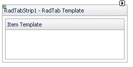

# Template Design Surface

## 

The __Template Design Surface__ lets you design templates for the items that appear in the tab strip. There are two ways to display the Template Design Surface:

* Choose __Edit Templates__ from the __RadTabStrip__[Smart Tag]().

* Choose __Edit Template__ from the __RadTabStrip__ context menu and select the type of template you want to edit.

Either way, the Template Design Surface appears:

On the design surface, you can drag any controls from the toolbox, as well as typing any literal text.

You can edit templates for all items using the __RadTab Template__. You can also edit templates for individual tab items. Once you have added tab items to your __RadTabStrip__ component, select a specific item from the list of item templates in the Smart Tag, or edit them all at once by choosing __Edit Template | Item Templates__ from the __RadTabStrip__ context menu.

When you have finished designing your template, choose __End Template Editing__ from the __RadTabStrip__ context menu or Smart Tag.

# See Also

 * [Overview]()
