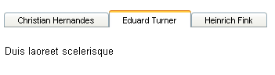

# Binding to a Data Source


## 

This tutorial will show how to bind __RadTabStrip__ to an __AccessDataSource__:

1. Locate the file "BlogPosts.mdb" file that appears in the __Live Demos/App_Data__ folder of your __RadControls "__for ASP.NET Ajax" installation. Drag this file to the __App_Data__ folder in the Solution Explorer for your project:

1. Drag a __RadTabStrip__ component from the toolbox onto your Web page. The __RadTabStrip__[Smart Tag]() should appear automatically:

1. In the __RadTabStrip__ Smart Tag, use the __Skin__ drop-down to change the [skin]() for the __RadTabStrip__ to "Outlook":

1. Still in the Smart Tag, open the __Choose Data Source__ drop-down and select __New Data Source__.

1. The Data Source Configuration Wizard appears. In the Select a DataSource Type screen, specify an __AccessDataSource__ and click __OK.__

1. In the __Choose a Database__ screen, click the __Browse__ button, and select the "BlogPosts.mdb" file. Then choose __Next__ to continue:

1. In the __Configure the Select Statement__ screen, choose __Specify columns from a table or view__, and select the "Author" and "Title" fields. Then choose __Next__ to continue:

1. Click the Test Query button to see the data from the data source. Then choose Finish to exit the Wizard:

1. In the Properties pane for the __RadTabStrip__ component:

1. Set the __DataTextField__ property to "Author".

1. Set the __DataValueField__ property to "Title".

1. Drag a __TextBox__ control from the toolbox onto your Web page below the __RadTabStrip__ control:

* Set the __BorderWidth__ property to "0px".

* Set the __Width__ property to "100%".

1. Add the following __TabClick__ event handler to your __RadTabStrip__ control so that the text box shows the value of a tab item when the user selects it:

>tabbedCode

````C#
	protected void RadTabStrip1_TabClick(object sender, Telerik.Web.UI.RadTabStripEventArgs e)
	{
	 TextBox1.Text = e.Tab.Value;
	} 
				
````
````VB.NET
	Protected Sub RadTabStrip1_TabClick(ByVal sender As Object, _
	        ByVal e As Telerik.Web.UI.RadTabStripEventArgs) _
	        Handles RadTabStrip1.TabClick
	  TextBox1.Text = e.Tab.Value
	End Sub  
	
	
				
````
>end

1. Run the application. Note that the tabs are labelled using the "Author" field of the data source. Click on a tab. Note that the text box displays the value of the "Title" field:

# See Also

 * [Overview]()

 * [Getting Started]()
