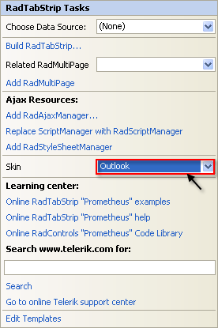

# Getting Started

This tutorial will walk you through creating a __RadTabStrip__ and shows how to:

* Use the __RadTabStrip__ item builder to add items to __RadTabStrip__.

* Set properties on the items in the tab strip.

* Apply a skin to specify the look and feel of the tab strip.

* Use __RadMultiPage__ to represent the content of tab pages.

* Add pages to a __RadMultiPage__ control.

* Add controls to a page in a __RadMultiPage__ control.

## Creating a tab strip using the RadTabStrip Item Builder

1. Drag a __RadTabStrip__ control from the toolbox onto your Web page. The __RadTabStrip__[Smart Tag]() should appear automatically:

1. On the Smart Tag, choose __Build RadTabStrip.__ The [RadTabStrip Item Builder]() appears:____

1. Click the __Add root item__ button () to add a root item to your tab strip.

1. The right pane of the __RadTabStrip Item Builder__ displays the properties for your new root item. Change its __Text__ property to "Calendar": 

1. Click the __Add root item__ button three more times to add three more root items to your tab strip. Set their properties as follows:

* On the first new item (the second root item), set the __Text__ property to "Colors".

* On the next new item, set the __Text__ property to "Quote" and the __IsBreak__ property to __True__.

* On the last new item, set the __Text__ property to "Web Sites".The __RadTabStrip Item Builder__ should now look like the following screen shot:

1. Select the "Web Sites" root item, and then click the __Add child item__ button () to add a child to that root item. With the child item selected, set the following properties:

* Set the __Text__ property to "Telerik".

* Set the __NavigateUrl__ property to "http://www.Telerik.com".

1. Select the "Web Sites" root item again, and add another child item.

* Set its __Text__ property to "Google".

* Set its __NavigateUrl__ property to "http://www.Google.com".The __RadTabStrip Item Builder__ should now look like the following:

1. Click OK to exit the __RadTabStrip Item Builder__.

1. Back in the __RadTabStrip__ Smart Tag, use the __Skin__ drop-down to change the [skin ]() for the __RadTabStrip__ to "Outlook":

1. The appearance of the __RadTabStrip__ in the designer changes to reflect the new skin:  You can also click on the tabs even in design time: 

1. Right click on the __RadTabStrip__, and from its context menu, choose __Properties__.

1. In the Properties pane, set the __ReorderTabsOnSelect__ property to __True__:

## Creating a RadMultiPage control

1. On the __RadTabStrip__ Smart Tag, click the __Add RadMultiPage__ link:

1. A __RadMultiPage__ control appears on the Web page below the __RadTabStrip__. On the __RadMultiPage__ Smart Tag, click the "Add RadPageView" link three times, to add three pages to the __RadMultiPage__ control:Once you have added the RadPageView you can add pageviews to it using the RadPageView's __SmartTag__

1. On the first __RadPageView__ control ("RadPageView1"),

1. Delete the text that appeared by default.

1. Drag a __RadCalendar__ control from the toolbox onto the surface of the __RadPageView__.

1. Set the __Skin__ property of the __RadCalendar__ control to "Outlook" so that it matches the look and feel of the tab strip:

1. On the second __RadPageView__ control ("RadPageView1"), drag a __RadColorPicker__ control from the toolbox onto the surface of the __RadPageView__:

1. On the third __RadPageView__ control ("RadPageView3"), type the text of a quotation onto the surface of the control:

1. Run the application. The tab strip appears, containing two rows: the first three items appear in the first row, and the fourth item in a second row. This is because you set the __IsBreak__ property to __True__ for the third item, creating a break before the fourth item.

1. Click on one of the first three tabs. The tab moves down to the bottom row (because the __ReorderTabsOnSelect__ property is __True__) and the corresponding page from the __RadMultiPage__ control appears:

1. Click on the "Web Sites" tab. It moves down to the bottom row and displays tabs for the two child items:

1. Click on one of the child items. The Web page changes to the page you specified using the __NavigateUrl__ property.

# See Also

 * [Binding to a Data Source]()
