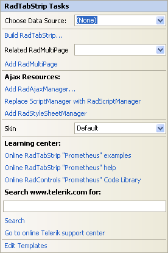
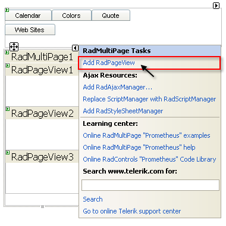

# Getting Started

This tutorial will walk you through creating a **RadTabStrip** and shows how to:

* Use the **RadTabStrip** item builder to add items to **RadTabStrip**.

* Set properties on the items in the tab strip.

* Apply a skin to specify the look and feel of the tab strip.

* Use **RadMultiPage** to represent the content of tab pages.

* Add pages to a **RadMultiPage** control.

* Add controls to a page in a **RadMultiPage** control.

## Creating a tab strip using the RadTabStrip Item Builder

1. Drag a **RadTabStrip** control from the toolbox onto your Web page. The **RadTabStrip** [Smart Tag]() should appear automatically:

1. On the Smart Tag, choose **Build RadTabStrip.** The [RadTabStrip Item Builder]() appears: 
**

1. Click the **Add root item** button () to add a root item to your tab strip.

1. The right pane of the **RadTabStrip Item Builder** displays the properties for your new root item. Change its **Text** property to "Calendar": 

1. Click the **Add root item** button three more times to add three more root items to your tab strip. Set their properties as follows:

* On the first new item (the second root item), set the **Text** property to "Colors".

* On the next new item, set the **Text** property to "Quote" and the **IsBreak** property to **True**.

* On the last new item, set the **Text** property to "Web Sites".The **RadTabStrip Item Builder** should now look like the following screen shot:

1. Select the "Web Sites" root item, and then click the **Add child item** button () to add a child to that root item. With the child item selected, set the following properties:

* Set the **Text** property to "Telerik".

* Set the **NavigateUrl** property to "http://www.Telerik.com". 

1. Select the "Web Sites" root item again, and add another child item.

* Set its **Text** property to "Google".

* Set its **NavigateUrl** property to `http://www.Google.com`.The **RadTabStrip Item Builder** should now look like the following:

1. Click OK to exit the **RadTabStrip Item Builder**.

1. Back in the **RadTabStrip** Smart Tag, use the **Skin** drop-down to change the [skin ]() for the **RadTabStrip** to "Outlook":

1. The appearance of the **RadTabStrip** in the designer changes to reflect the new skin:  You can also click on the tabs even in design time: 

1. Right click on the **RadTabStrip**, and from its context menu, choose **Properties**.

1. In the Properties pane, set the **ReorderTabsOnSelect** property to **True**:

## Creating a RadMultiPage control

1. On the **RadTabStrip** Smart Tag, click the **Add RadMultiPage** link:

1. A **RadMultiPage** control appears on the Web page below the **RadTabStrip**. On the **RadMultiPage** Smart Tag, click the "Add RadPageView" link three times, to add three pages to the **RadMultiPage** control:Once you have added the RadPageView you can add pageviews to it using the RadPageView's **SmartTag**

1. On the first **RadPageView** control ("RadPageView1"),

1. Delete the text that appeared by default.

1. Drag a **RadCalendar** control from the toolbox onto the surface of the **RadPageView**.

1. Set the **Skin** property of the **RadCalendar** control to "Outlook" so that it matches the look and feel of the tab strip:

1. On the second **RadPageView** control ("RadPageView1"), drag a **RadColorPicker** control from the toolbox onto the surface of the **RadPageView**:

1. On the third **RadPageView** control ("RadPageView3"), type the text of a quotation onto the surface of the control:

1. Run the application. The tab strip appears, containing two rows: the first three items appear in the first row, and the fourth item in a second row. This is because you set the **IsBreak** property to **True** for the third item, creating a break before the fourth item.

1. Click on one of the first three tabs. The tab moves down to the bottom row (because the **ReorderTabsOnSelect** property is **True**) and the corresponding page from the **RadMultiPage** control appears:

1. Click on the "Web Sites" tab. It moves down to the bottom row and displays tabs for the two child items:

1. Click on one of the child items. The Web page changes to the page you specified using the **NavigateUrl** property.

# See Also

 * [Binding to a Data Source]()
