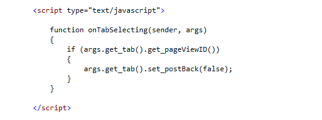
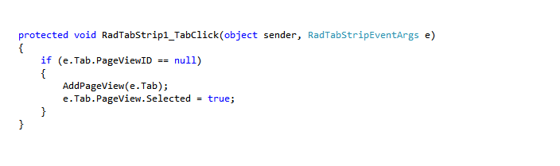

# How To


## 

**Q:** I get the following error message: **Multiple controls with the same ID were found. FindControl requires that controls have unique IDs**. What am I doing wrong?

**A:** It is very likely that you get this error message when you create your controls at runtime. In general it indicates that you create another control with the same ID on a postback of the page. There are a couple of ways to workaround it:

* To prevent the postback of the page as implemented in our [Load on Demand demo](http://demos.telerik.com/aspnet-ajax/tabstrip/examples/applicationscenarios/loadondemand/defaultcs.aspx) and using the **OnClientTabSelecting** client side event.

* If you need the page to do a postback you **do not** need to attach the client-side **OnClientTabSelecting** event but simply need to check if there is already an existing PageViewId in the **OnTabClick** server side event handler:

**Q:** When I use the code below I am able to select the child tab when I click on a parent tab but I cannot load the content of its corresponding page when I use NavigateUrl property:


````JavaScript
<script type="text/javascript">
function ClientTabSelectedHandler(sender, eventArgs) {
	var tab = eventArgs.get_tab();
	if (tab.get_tabs().get_count() > 0) {
 		tab.get_tabs().getTab(0).click();
	}
}
</script>
````

**A:** You may add this code to your RadTabStrip control so that you can get the desired behavior:

````JavaScript
<script type="text/javascript">
	function ClientTabSelectedHandler(sender, eventArgs) {
	  var tabStrip = sender;
	  var tab = eventArgs.get_tab();
	  if (tab.get_tabs().get_count() > 0) {
	      tab.get_tabs().getTab(0).click();
	      var url = tab.get_tabs().getTab(0).get_navigateUrl();
	      document.location.href = url;
	  }
	}
</script>
````

````ASPNET	
<telerik:RadTabStrip id="RadTabStrip" runat="server" Skin="Outlook" EnableViewState="False" OnClientTabSelected="ClientTabSelectedHandler">
  <Tabs>
    <telerik:RadTab runat="server" Text="RootTabLevel0Tab0" NavigateUrl="~/Tabs/Home.aspx"></ telerik:RadTab>
    <telerik:RadTab runat="server" Text="RootTabLevel0Tab1">
     <Tabs>
        <telerik:RadTab runat="server" Text="ChildTabLevel1Tab0" NavigateUrl="~/Tabs/ChildTabContent0.aspx"></telerik:RadTab>
        <telerik:RadTab runat="server" Text="ChildTabLevel1Tab1" NavigateUrl="~/Tabs/ChildTabContent1.aspx"></telerik:RadTab>
        <telerik:RadTab runat="server" Text="ChildTabLevel1Tab2" NavigateUrl="~/ Tabs/ChildTabContent2.aspx"></telerik:RadTab>
      </Tabs>
    </ telerik:RadTab>
  </Tabs>
</ telerik:RadTabStrip>	
````


**Q:** Can I do Intended-vertical-left align tabs? If so, how can it be done?

**A:** By using the *OuterCssClass=""* and *CssClass* proprties of the RadTabstrip control along with the right css class selectors you can achieve the desired look. Example:

````ASPNET	
<style type="text/css">
	.border
	{	border-bottom: 1px solid grey; }
	 .RadTabStripVertical li.rtsLI .new, .new
	{	padding-left: 10px !important;}
	.RadTabStripVertical li.rtsLI .new1, .new1
	{	padding-left: 20px !important;	}
	.RadTabStripVertical li.rtsLI .new2, .new2
	{	padding-left: 30px !important;}
</style>
````

````ASPNET
<telerik:RadTabStrip ID="Radtabstrip1" runat="server" SelectedIndex="1" Orientation="VerticalLeft">
	<Tabs>
		<telerik:RadTab ImageUrl="VImg/icon_05.gif" Text="Management" CssClass="border">
		</telerik:RadTab>
		<telerik:RadTab ImageUrl="VImg/icon_02.gif" Text="Scheduling" OuterCssClass="new" CssClass="border">
		</telerik:RadTab>
		<telerik:RadTab ImageUrl="VImg/icon_03.gif" Text="Meetings" OuterCssClass="new1" CssClass="border">
		</telerik:RadTab>
		<telerik:RadTab ImageUrl="VImg/icon_04.gif" Text="Briefcase" OuterCssClass="new2" CssClass="border">
		</telerik:RadTab>
		<telerik:RadTab ImageUrl="VImg/icon_01.gif" Text="Settings">
		</telerik:RadTab>
	</Tabs>
</telerik:RadTabStrip>
````


