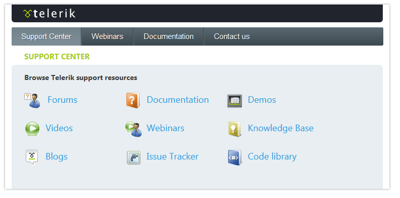

# TabStrip Overview

## 

**Telerik RadTabStrip** is an easy and flexible navigation component that can be used in ASP.NET AJAX applications.It also can be used in a combination with the [Telerik RadMultiPage]() so that the user can easily manage the content of pages that are selected fron the **RadTabStrip**.

Using **RadTabStrip**, you get:

* A [client-side API]() that includes the ability to add, remove and update tabs. One can also have these changes persist after a postback to the server.

* Numerous options in how to populate the tab strip, including

* [Defining tabs statically at design time]().

* [Creating tabs dynamically on the server-side]().

* [Creating tabs dynamically on the client-side]().

* [Loading tabs from an XML file or string]().

* [Binding to an ASP.NET declarative DataSource component]().

* Many options for [controlling appearance](), including:

* The ability to [add images to tabs]()

* Control over the [layout of tabs]().

* Built-in [skins]() to quickly change the look and feel.

* [Style sheet support for individual tabs]().

* The ability to create your own [custom skins]().

* Support for [right-to-left locales]().

* Support for [templates]().

* The ability to [Drag and Drop tabs]().

* The ability to manage tab page content separately from tab pages, including using [pages from the RadMultiPage control]().

* [Scrollable tabs]().

* [Custom attributes]() to extend the capabilities of the menu items.

* Lightweight markup (no tables).

* [Cross-page postbacks](), which let you direct postbacks from the menu to a different Web page.

* Support for [ASP.NET validation]().

* Support for all major browsers, including Internet Explorer 5.0 and above, Netscape 8.0 and above, Mozilla 1.0 and above,Firefox 0.8 and above, Opera 7.5 and above, and Safari 2.0.4 and above.

