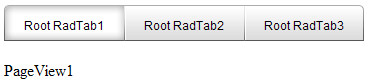

# Adding Pageviews at the Client-Side

## 

You can add PageViews at the client-side and apply simple HTML to the pageviews.

**Example:**

````ASPNET	 
<script>
   function pageLoad()
   {            
       var multiPage = $find("<%=RadMultiPage1.ClientID %>");                        

       multiPage.trackChanges();

       var pageView = new Telerik.Web.UI.RadPageView();      
       multiPage.get_pageViews().add(pageView);           
       pageView.get_element().innerHTML = "PageView1";            

       multiPage.commitChanges();
   }  
</script>
<asp:ScriptManager ID="ScriptManager" runat="server" />
<telerik:RadTabStrip RenderMode="Lightweight" ID="RadTabStrip1" runat="server" MultiPageID="RadMultiPage1">
   <Tabs>
       <telerik:RadTab runat="server" Text="Root RadTab1">
       </telerik:RadTab>
       <telerik:RadTab runat="server" Text="Root RadTab2">
       </telerik:RadTab>
       <telerik:RadTab runat="server" Text="Root RadTab3">
       </telerik:RadTab>
   </Tabs>
</telerik:RadTabStrip>    
<telerik:RadMultiPage ID="RadMultiPage1" runat="server">            
</telerik:RadMultiPage> 	 
````

The result will be:




