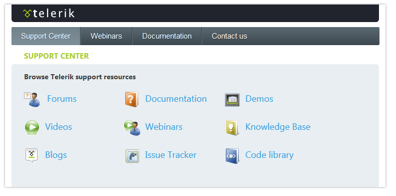

# RadMultiPage Overview


You can use the **RadMultiPage** control to organize the content of tabbed pages.**RadMultiPage** acts as a container for **RadPageView** controls, where each **RadPageView** represents the content of a page associated with a tab in a **RadTabStrip** control. Separated from the tab strip labels, the content can be positioned anywhere on the page.

**RadMultiPage** is intended to be used primarily with **RadTabStrip**. At the same time, **RadMultiPage** is a self-contained component that can be used as a general multi-page application.

The screenshot below shows **RadTabStrip** together with **RadMultiPage**.



To integrate **RadTabStrip** with **RadMultiPage**, set the **MultiPageID** property of the tab strip to the **ID** of the multi-page instance. For more details, see [Integrating RadMultiPage with RadTabStrip]().

>note See a live example of this functionality at [www.telerik.com](https://demos.telerik.com/aspnet-ajax/tabstrip/examples/functionality/multipage/defaultcs.aspx).
>


## Structure

**RadMultiPage** acts as a container for **RadPageView** controls. Each **RadPageView** control in turn contains child controls such as buttons and text boxes. You can programmatically show and hide a particular **RadPageView** on the sever and client side.

**RadMultiPage** consists of several **RadPageView** controls used to hold and display information. The structure of a **RadMultiPage** looks like the following:

````ASPNET	 
<telerik:RadMultiPage id="RadMultiPage1" runat="server" SelectedIndex="0" Width="400">
  <telerik:RadPageView id="Pageview1" runat="server">
      Name: John Smith<br />
      Birthday: October 20th 1976<br />
      Marital Status: Single
      <br />
  </telerik:RadPageView>
  <telerik:RadPageView id="Pageview2" runat="server">
      ...
      Content of the Pageview2
      ...
  </telerik:RadPageView>
  <telerik:RadPageView id="Pageview3" runat="server">
      ...
      Content of the Pageview3
      ...
  </telerik:RadPageView>
</telerik:RadMultiPage> 	 
````

## Appearance

The visual appearance can be defined using CSS style sheets applied to the multi-page structure elements (the **RadPageView** controls).

# See Also

 * [Integrating with  RadTabStrip]()

 * [RadMultiPage Scroll Bars]()
