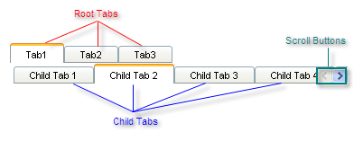

# Structure


## 

The structure of the __RadTabStrip__ control is as follows:



The tab strip consists of a hierarchy of tabs. The tabs on one level are exposed when the parent tab on the previous level is selected. Each tab is represented by a __RadTab__ instance.

* At the top level are the __root tabs__. These items are always visible. They are available using the __Tabs__ property of the tab strip control (__RadTabStrip.Tabs__).

* Each root tab may have, nested within it, a set of child tabs. Children of the root tabs are available using the __Tabs__ property of the root tab (__RadTab.Tabs__)

* Child tabs may have, nested within them, their own sets of child tabs.

The selected tab at any level has an appearance that is distinct from its siblings, and typically lacks a border on one side so that it appears to emerge from that portion of the page.

If the tab strip does not have room to display all of the tabs at one level, and if scrolling is enabled, a set of scroll buttons appear on the same level as the tabs, to allow users to scroll to the tabs that could not fit.

If the tabs are created at design time, the hierarchy is reflected in the ASP.NET declaration of the tab strip:

````ASPNET
	<telerik:RadTabStrip ID="RadTabStrip1" runat="server" >
	 <Tabs>
	   <telerik:RadTab
	        runat="server"
	        Text="Tab1"
	        PerTabScrolling="True"
	        ScrollChildren="True"
	        Selected="True">
	     <Tabs>
	        <telerik:RadTab runat="server" Text="Child Tab 1" />
	        <telerik:RadTab runat="server" Text="Child Tab 2" Selected="True" />
	        <telerik:RadTab runat="server" Text="Child Tab 3" />
	        <telerik:RadTab runat="server" Text="Child Tab 4" />
	        <telerik:RadTab runat="server" Text="Child Tab 5" />
	     </Tabs>
	   </telerik:RadTab>
	   <telerik:RadTab runat="server" Text="Tab2" />
	   <telerik:RadTab runat="server" Text="Tab3" />
	 </Tabs>
	</telerik:RadTabStrip> 
				
````


