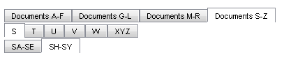

# Declaring Tabs Statically in Design Time


## 

It is easy to define the hierarchy of tabs statically at design time. You can use the [RadTabStrip Item Builder]() to create the hierarchy in the Visual Studio Designer:

Alternately, you can use the Source page to specify the items declaratively:

````ASPNET
	
	<telerik:RadTabStrip ID="RadTabStrip1" runat="server" Skin="Vista" >
	 <Tabs>
	   <telerik:RadTab runat="server" Text="Documents A-F">
	     <Tabs>
	       <telerik:RadTab runat="server" Text="A" />
	       <telerik:RadTab runat="server" Text="B" />
	       <telerik:RadTab runat="server" Text="C" />
	       <telerik:RadTab runat="server" Text="D" />
	       <telerik:RadTab runat="server" Text="E" />
	       <telerik:RadTab runat="server" Text="F" />
	     </Tabs>
	   </telerik:RadTab>
	   <telerik:RadTab runat="server" Text="Documents G-L">
	     <Tabs>
	       <telerik:RadTab runat="server" Text="G" />
	       <telerik:RadTab runat="server" Text="H" />
	       <telerik:RadTab runat="server" Text="I" />
	       <telerik:RadTab runat="server" Text="J" />
	       <telerik:RadTab runat="server" Text="K" />
	       <telerik:RadTab runat="server" Text="L" />
	     </Tabs>
	   </telerik:RadTab>
	   <telerik:RadTab runat="server" Text="Documents M-R">
	     <Tabs>
	       <telerik:RadTab runat="server" Text="M" />
	       <telerik:RadTab runat="server" Text="N" />
	       <telerik:RadTab runat="server" Text="O" />
	       <telerik:RadTab runat="server" Text="P" />
	       <telerik:RadTab runat="server" Text="Q" />
	       <telerik:RadTab runat="server" Text="R" />
	     </Tabs>
	   </telerik:RadTab>
	   <telerik:RadTab runat="server" Text="Documents S-Z">
	     <Tabs>
	       <telerik:RadTab runat="server" Text="S">
	          <Tabs>
	             <telerik:RadTab runat="server" Text="SA-SE" />
	             <telerik:RadTab runat="server" Text="SH-SY" />
	          </Tabs>
	       </telerik:RadTab>
	       <telerik:RadTab runat="server" Text="T" />
	       <telerik:RadTab runat="server" Text="U" />
	       <telerik:RadTab runat="server" Text="V" />
	       <telerik:RadTab runat="server" Text="W" />
	       <telerik:RadTab runat="server" Text="XYZ" />
	     </Tabs>
	   </telerik:RadTab>
	 </Tabs>
	</telerik:RadTabStrip> 
		
````


The result is a hierarchy of tabs:



# See Also

 * [Custom Attributes]()

 * [Overview]()
