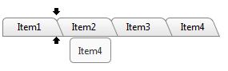
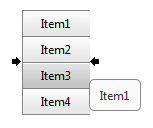

# Drag-To-Reorder Tabs

## Drag To Reorder

As of __Q3 2012__ RadTabStrip provides functionality to reorder its tabs by dragging. This new feature is enabled through the __EnableDragToReorder__ property of the control. Important aspect is that tabs could be dragged and reordered only in the child list level to which they belong. When a tab is moved to a new position its children will be moved along with it. The usage of RadMultiPage along with the RadTabStrip is also supported with this feature enabled.

The reordering functionality is available both in vertical and horizontal orientation of the control.
>caption 

>caption 

When the scrolling is enabled the tabs of the RadTabStrip could be srolled while dragging by hovering over the scroll buttons.

### Events

With the introduction of the new feature new event has been added as well. There are three client-side events and a server-side one.

The __[OnReordered]()__ is the newly introduced server-side event, it will be fired immediatelly after a drag-to-reorder operation is being completed.

The client-side events are the following:

1. __[OnClientTabDragStart]()__ - a cancelable event which is fired when a drag-to-reorder operation is about to start.

1. __[OnClientReordering]()__ - a cancelable event which is fired when the dragged tab is dropped on a new position.

1. __[OnClientReordered]()__ - this event is fired when the drag-to-reorder operation is completed and the dragged tab is moved to the position where it has been dropped.
