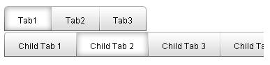
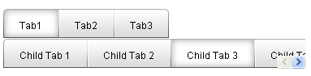
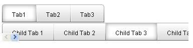
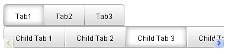
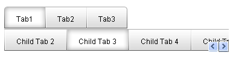
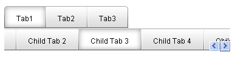

# Scrolling Tabs

By default, when there is not enough room to display all the tabs at one level, **RadTabStrip** simply truncates the display:

A number of properties let you change this to allow the user to scroll the tabs at a level.

>tip As an alternate to scrolling, you can also set the **IsBreak** property on a tab so that the tabs at a single level appear in multiple rows.
>

## Enabling Scrolling

To enable scrolling for a set of tabs in the tab strip, set the **ScrollChildren** property of the parent tab to **True**. You can enable scrolling on the root level tabs by setting the **ScrollChildren** property of the **TabStrip** to **True**.

When scrolling is enabled, a pair of scroll buttons appears in the set of tabs:

>note Scrolling is only an option if the [orientation]() of the tab strip is horizontal.
>

## Positioning the Scroll Buttons

The **ScrollButtonsPosition** property determines the position of the scroll buttons. Set the **ScrollButtonsPosition** property the parent tab to position the scroll buttons in the line of child tabs. To position the scroll buttons on the root-level tabs, set the **ScrollButtonsPostion** property of the **RadTabStrip** control.

When **ScrollButtonsPosition** is "Right" (the default) a pair of scroll buttons appear at the right end of the line of tabs:

When **ScrollButtonsPosition** is "Left", the scroll buttons appear at the left end of the line of tabs:

When **ScrollButtonsPosition** is "Middle", the button for scrolling left appears on the left end of the line of tabs, and the button for scrolling right appears on the right end:

## Scrolling Behavior

Set the **PerTabScrolling** property (for the **RadTabStrip** control or for a parent **RadTab** object) to specify how the line of child tabs responds when the user clicks on a scroll button.

When **PerTabScrolling** is **True**, the line of tabs scrolls in steps, so that it always starts at the beginning of a tab:

When **PerTabScrolling** is **False**, the line of tabs scrolls in a smooth continuous motion, so that the first tab can appear cut off:

>note When **PerTabScrolling** is **True**, the **ScrollPosition** property specifies the initial scroll position (the index of the first tab to appear in the list).
>

