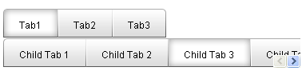
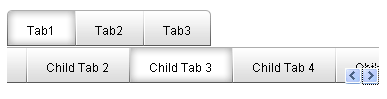

# Scrolling Tabs

By default, when there is not enough room to display all the tabs at one level, __RadTabStrip__ simply truncates the display:

A number of properties let you change this to allow the user to scroll the tabs at a level.

>tip As an alternate to scrolling, you can also set the __IsBreak__ property on a tab so that the tabs at a single level appear in multiple rows.
>

## Enabling Scrolling

To enable scrolling for a set of tabs in the tab strip, set the __ScrollChildren__ property of the parent tab to __True__. You can enable scrolling on the root level tabs by setting the __ScrollChildren__ property of the __TabStrip__ to __True__.

When scrolling is enabled, a pair of scroll buttons appears in the set of tabs:

>note Scrolling is only an option if the[orientation]()of the tab strip is horizontal.
>

## Positioning the Scroll Buttons

The __ScrollButtonsPosition__ property determines the position of the scroll buttons. Set the __ScrollButtonsPosition__ property the parent tab to position the scroll buttons in the line of child tabs. To position the scroll buttons on the root-level tabs, set the __ScrollButtonsPostion__ property of the __RadTabStrip__ control.

When __ScrollButtonsPosition__ is "Right" (the default) a pair of scroll buttons appear at the right end of the line of tabs:

When __ScrollButtonsPosition__ is "Left", the scroll buttons appear at the left end of the line of tabs:

When __ScrollButtonsPosition__ is "Middle", the button for scrolling left appears on the left end of the line of tabs, and the button for scrolling right appears on the right end:

## Scrolling Behavior

Set the __PerTabScrolling__ property (for the __RadTabStrip__ control or for a parent __RadTab__ object) to specify how the line of child tabs responds when the user clicks on a scroll button.

When __PerTabScrolling__ is __True__, the line of tabs scrolls in steps, so that it always starts at the beginning of a tab:

When __PerTabScrolling__ is __False__, the line of tabs scrolls in a smooth continuous motion, so that the first tab can appear cut off:

>note When __PerTabScrolling__ is __True__ , the __ScrollPosition__ property specifies the initial scroll position (the index of the first tab to appear in the list).
>

