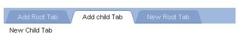

# Working With Tabs at the Server

Using the server-side API, you can programmatically add, remove, and edit the tabs in a tab strip.

## Adding tabs on page load

After adding a **RadTabStrip** control to your Web page, you can use the following server-side code to add tabs when the page loads:


````C#
protected void Page_Load(object sender, EventArgs e)
{
  if (!Page.IsPostBack)
  {
    RadTab tab1 = new RadTab();
    tab1.Text = "Tab 1";
    RadTab tab11 = new RadTab();
    tab11.Text = "Child 1";
    tab1.Tabs.Add(tab11);
    RadTab tab2 = new RadTab();
    tab2.Text = "Tab 2";
    RadTab tab3 = new RadTab();
    tab3.Text = "Telerik";
    tab3.NavigateUrl ="http://www.telerik.com";
    RadTabStrip1.Tabs.Add(tab1);
    RadTabStrip1.Tabs.Add(tab2);
    RadTabStrip1.Tabs.Add(tab3);
  }
}				
````
````VB.NET
Protected Sub Page_Load(ByVal sender As Object, ByVal e As
    EventArgs) Handles Me.Load
    If Not Page.IsPostBack Then
        Dim tab1 As New RadTab()
        tab1.Text = "Tab 1"
        Dim tab11 As New RadTab()
        tab11.Text = "Child 1"
        tab1.Tabs.Add(tab11)
        Dim tab2 As New RadTab()
        tab2.Text = "Tab 2"
        Dim tab3 As New RadTab()
        tab3.Text = "Telerik"
        tab3.NavigateUrl = "http://www.telerik.com"
        RadTabStrip1.Tabs.Add(tab1)
        RadTabStrip1.Tabs.Add(tab2)
        RadTabStrip1.Tabs.Add(tab3)
    End If
End Sub		
````

## Adding tabs dynamically

You can dynamically update the **Tabs** collection of **RadTabStrip** and **RadTab** in response to a postback as well. Consider the following tab strip declaration:

````ASPNET	   	
<telerik:RadTabStrip RenderMode="Lightweight" ID="RadTabStrip1" runat="server" OnTabClick="RadTabStrip1_TabClick">
  <Tabs>
    <telerik:RadTab runat="server" Text="Add Root Tab" Value="R">
    </telerik:RadTab>
    <telerik:RadTab runat="server" Text="Add child Tab" Value="C">
    </telerik:RadTab>
  </Tabs>
</telerik:RadTabStrip>				
````

The **TabClick** event handler adds tabs dynamically at runtime in the post-back:


````C#
protected void RadTabStrip1_TabClick(object sender, RadTabStripEventArgs e)
{
  switch (e.Tab.Value)
  {
    case "R": // add a new root tab
      RadTab RootTab = new RadTab();
      RootTab.Text = "New Root Tab";
      RootTab.Value = "C";
      RadTabStrip1.Tabs.Add(RootTab);
      break;
    case "C": // add a new child tab
      RadTab ChildTab = new RadTab();
      RadTab ParentTab = e.Tab;
      ChildTab.Text = "New ChildTab";
      ParentTab.Tabs.Add(ChildTab);
      break;
  }
}				
````
````VB.NET
Protected Sub RadTabStrip1_TabClick(ByVal sender As Object, _ByVal e As RadTabStripEventArgs) _Handles RadTabStrip1.TabClick
    Select Case e.Tab.Value
        Case "R"
            ' add a new root tab
            Dim RootTab As New RadTab()
            RootTab.Text = "New Root Tab"
            RootTab.Value = "C"
            RadTabStrip1.Tabs.Add(RootItem)
            Exit Select
        Case "C"
            ' add a new child tab
            Dim ChildTab As New RadTab()
            Dim ParentTab As RadTab = e.Tab
            ChildTab.Text = "New Child Tab"
            ParentTab.Tabs.Add(ChildTab)
            Exit Select
    End Select
End Sub
````

Clicking on both menu items results in the following:



## Removing, disabling, and enabling items

To remove a tab in server-side code, use the **Remove** method of the **RadTabCollection** object that contains it. To enable or disable a tab, use the **Enabled** property of the **RadTab** object itself. The following example demonstrates these techniques.

Consider the following tab strip:

````ASPNET
<telerik:RadTabStrip RenderMode="Lightweight" ID="RadTabStrip1" runat="server" OnTabClick="RadTabStrip1_TabClick">
  <Tabs>
    <telerik:RadTab runat="server" Text="Delete a Tab" Value="D">
      <Tabs>
        <telerik:RadTab runat="server" Text="Child 1" />
        <telerik:RadTab runat="server" Text="Child 2" />
        <telerik:RadTab runat="server" Text="Child 3" />
        <telerik:RadTab runat="server" Text="Child 4" />
      </Tabs>
    </telerik:RadTab>
    <telerik:RadTab  runat="server" Text="Disable a Tab" Value="E">
      <Tabs>
        <telerik:RadTab runat="server" Text="Child 1" />
        <telerik:RadTab runat="server" Text="Child 2" />
        <telerik:RadTab runat="server" Text="Child 3" />
        <telerik:RadTab runat="server" Text="Child 4" />
      </Tabs>
    </telerik:RadTab>
  </Tabs>
</telerik:RadTabStrip>				
````

The **TabClick** event handler deletes, disables, and enables tabs dynamically at runtime in the post-back when child tabs are clicked. It deletes children of the first root tab and disables the selected child tab of the second root tab, enabling all of its siblings:

````C#
protected void RadTabStrip1_TabClick(object sender, RadTabStripEventArgs e)
{
  if (e.Tab.Owner is RadTab)
  {
    RadTab parentTab = (RadTab)e.Tab.Owner;
    switch (parentTab.Value)
    {
      case "D":
        parentTab.Tabs.Remove(e.Tab);
        break;
      case "E":
        for (int i = 0; i < parentTab.Tabs.Count; i++)
        {
          parentTab.Tabs[i].Enabled = (parentTab.Tabs[i] != e.Tab);
        }
        break;
     }
  }
}
````
````VB.NET
Protected Sub RadTabStrip1_TabClick(ByVal sender As Object, ByVal e As RadTabStripEventArgs) Handles RadTabStrip1.TabClick
 If TypeOf e.Tab.Owner Is RadTab Then
   Dim parentTab As RadTab = DirectCast(e.Tab.Owner,
RadTab)
   Select Case parentItem.Value
     Case "D"
       parentTab.Tabs.Remove(e.Tab)
       Exit Select
     Case "E"
       Dim i As Integer = 0
       While i <
parentTab.Tabs.Count
        parentTab.Tab(i).Enabled = (parentTab.Tabs(i) <> e.Tab)

System.Math.Max(System.Threading.Interlocked.Increment(i),i - 1)
       End While
       Exit Select
   End Select
 End If
End Sub				
````


# See Also

 * [Working With Tabs at thr Client]()

 * [Overview]()

 * [Accessing Tabs]()
