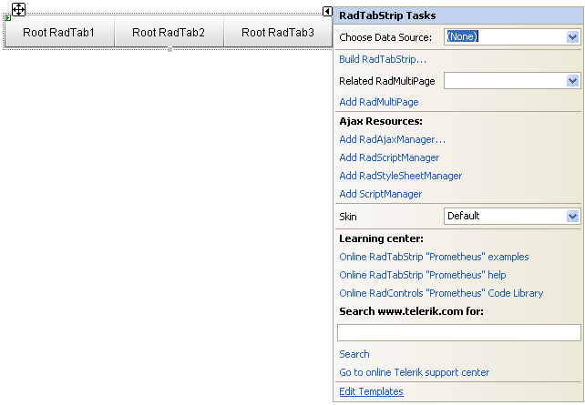
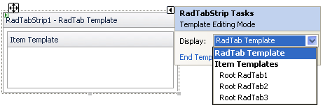
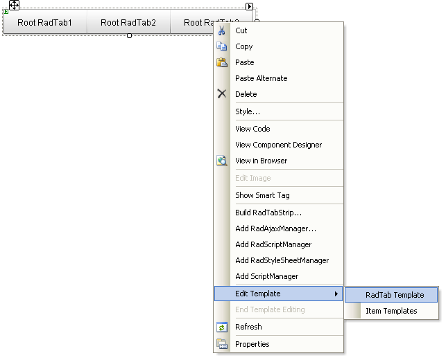
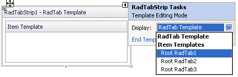
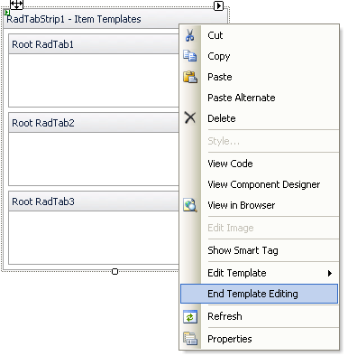

# Adding and Editing Templates at Design Time

## How to add and edit templates

To add and edit a **global (RadTabStrip Tab Template)** template:

1. Open the RadTabStrip Smart Tag, click **Edit Templates** and choose **RadTab Template**

 
or Right-click the instance of RadTabStrip, and select **Edit Template** | **RadTab Template** from the context menu 

1. Add any content to the **RadTab Template** editor. For example, to add a third-party control, drag the control from the Toolbox.

To add and edit a **per tab (Tab Template)** tabstrip template:

1. On the tabstrip Smart Tag, click **Edit Templates** and choose an item
  or right-click the instance of Telerik RadTabStrip, and select **Edit Template** --> **Item Templates**

1. Add any content to the template using the **Item Templates** editor. For example, to add a third-party control, drag the desired control from the Toolbox.

When you are done, press the **End Template Editing** option from the context menu or the Smart Tag:

