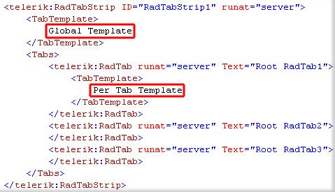

# ASPX Template Structure


## 

You can define two types of Telerik RadTabStrip templates:

1. __Global (RadTabStrip Tab Template)__ templates are applied to all RadTabs automatically;

1. __Per tab (Tab Template)__ templates override global templates.




>note  __DataBinder.Eval__ expressions work only when the tabstrip is in a bound mode. In other words, you should explicitly call the __DataBind()__ method even if no datasource is set to the tabstrip.
>


The following demonstrates how to embed RadMenu in the RadTabStrp tabs. For this purpose the (per-tab) TabTemplates of the tabs are used.


There is also a multipage control associated with the tabstrip to provide additional information.


````ASPNET
	
	<telerik:RadTabStrip ID="RadTabStrip1" runat="server" SelectedIndex="0" CssClass="tabStrip" MultiPageID="RadMultiPage1" OnClientTabSelected="onTabSelected">
	   <Tabs>
	       <telerik:RadTab Width="250px" PageViewID="RadPageView1">
	           <TabTemplate>
	               <table cellpadding="0" cellspacing="0">
	                   <tr>
	                       <td>
	                           Products: <span id="products">Books</span>
	                       </td>
	                       <td>
	                           <telerik:RadMenu runat="server" ID="RadMenu1" Skin="Telerik" OnClientItemClicked="onClicked">
	                               <CollapseAnimation Type="none" />
	                               <Items>
	                                   <telerik:RadMenuItem CssClass="rootItem" Text="(change )">
	                                       <Items>
	                                           <telerik:RadMenuItem Text="Books" PageViewID="RadPageView1">
	                                           </telerik:RadMenuItem>
	                                           <telerik:RadMenuItem Text="Cameras" PageViewID="RadPageView2">
	                                           </telerik:RadMenuItem>
	                                           <telerik:RadMenuItem Text="Apparel" PageViewID="RadPageView3">
	                                           </telerik:RadMenuItem>
	                                       </Items>
	                                   </telerik:RadMenuItem>
	                               </Items>
	                           </telerik:RadMenu>
	                       </td>
	                   </tr>
	               </table>
	           </TabTemplate>
	       </telerik:RadTab>
	       <telerik:RadTab PageViewID="RadPageView4" Width="250px">
	           <TabTemplate>
	               <table cellpadding="0" cellspacing="0">
	                   <tr>
	                       <td>
	                           Services: <span id="services">Web</span>
	                       </td>
	                       <td>
	                           <telerik:RadMenu runat="server" ID="RadMenu2" Skin="Telerik" OnClientItemClicked="onClicked">
	                               <CollapseAnimation Type="none" />
	                               <Items>
	                                   <telerik:RadMenuItem CssClass="rootItem" Text="(change )">
	                                       <Items>
	                                           <telerik:RadMenuItem Text="Web" PageViewID="RadPageView4">
	                                           </telerik:RadMenuItem>
	                                           <telerik:RadMenuItem Text="Finance" PageViewID="RadPageView5">
	                                           </telerik:RadMenuItem>
	                                       </Items>
	                                   </telerik:RadMenuItem>
	                               </Items>
	                           </telerik:RadMenu>
	                       </td>
	                   </tr>
	               </table>
	           </TabTemplate>
	       </telerik:RadTab>
	   </Tabs>
	</telerik:RadTabStrip> 
	
````


