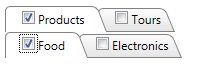

# Binding Templates

## 

Often, when you use tab templates, you want the controls in the template to display information associated with the tab properties. For example, consider a simple tab strip with a check box in the item template:

````ASPNET	     
<telerik:RadTabStrip RenderMode="Lightweight" ID="RadTabStrip1" runat="server" SelectedIndex="0">  
    <Tabs>    
        <telerik:RadTab runat="server" Text="Products" Selected="True" SelectedIndex="0">      
    <Tabs>        
        <telerik:RadTab runat="server" Text="Food" Selected="True" />        
        <telerik:RadTab runat="server" Text="Electronics" />      
    </Tabs>    
    </telerik:RadTab>    
        <telerik:RadTab runat="server" Text="Tours">      
    <Tabs>        
        <telerik:RadTab runat="server" Text="Europe" />        
        <telerik:RadTab runat="server" Text="South Pacific" />      
    </Tabs>    
        </telerik:RadTab>  
    </Tabs>  
    <TabTemplate>     
        <asp:CheckBox ID="CheckBox1" runat="server" />  
    </TabTemplate>
</telerik:RadTabStrip>				
````

When you run the application, the tabs all show check boxes with no labels:


This is hardly useful! To override the properties of the check box in the template, use a **DataBinder.Eval** statement:

````ASPNET	
<pre xmlns="http://ddue.schemas.microsoft.com/authoring/2003/5">
<ItemTemplate>  
    <asp:CheckBox ID="CheckBox1" Text='<%# DataBinder.Eval(Container, "Text") %>'    
    Checked='<%# DataBinder.Eval(Container, "Selected") %>'    
    runat="server" />
</ItemTemplate>
</pre>	          
````

In the DataBinder.Eval statement, **Container** is the **RadTab** and **"Text"** or **"Selected"** identifies the **Text** or **Selected** property of that item.

>note In this example, the first parameter to the DataBinder.Eval statement is **Container** , because the tabs are statically bound. If the tab strip was bound to a data source, then you must use **Container.DataItem** instead. e.g.<%#DataBinder.Eval(Container.DataItem, "TextField") %>
>


In addition to adding a DataBinder.Eval statement, you must also explicitly call the **DataBind** method for the tabs so that the template has access to the properties of the tab:


````C#
protected void Page_Load(object sender, EventArgs e) 
{ 
    for (int i = 0; i < RadTabStrip1.Tabs.Count; i++) 
    { 
        RadTabStrip1.Tabs[i].DataBind(); 
    } 
}	
````
````VB.NET	
Protected Sub Page_Load(ByVal sender As Object, ByVal e As EventArgs) Handles Me.Load
    Dim i As Integer = 0
    While i < RadTabStrip1.Tabs.Count
        RadTabStrip1.Tabs(i).DataBind()
        System.Math.Max(System.Threading.Interlocked.Increment(i), i - 1)
    End While
End Sub	
````


Now the check boxes reflect the properties of the tabs:


