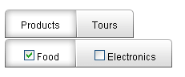

# Templates Overview

## 

**RadTabStrip** tabs are extremely configurable. In addition to the preset [skins](), you can customize the appearance of tabs by [adding custom images](), using [CSS classes](), or [creating custom skins](). However, if you want to embed other HTML controls in a tab, you must use templates. You can embed any content inside a **RadTabStrip** template, including:

* HTML markup

* ASP.NET server controls

* Other third-party controls (including other Telerik controls)

At design time, add item templates to your **RadTabStrip** control using the [Template Design Surface](). **RadTabStrip** supports two types of item templates:

1. The global **RadTab** template affects the appearance of all tabs in the tab strip.

1. Individual **Item** templates affect the appearance of a single tab, overriding the global **RadTab** template if it is set.

The following example uses both a global **RadTab** Template and individual **Item** templates to override the global template for the root level tabs:

````ASPNET	
<telerik:RadTabStrip RenderMode="Lightweight" ID="RadTabStrip1" runat="server" SelectedIndex="0">
 <Tabs>
   <telerik:RadTab runat="server" Text="Products" Selected="True" SelectedIndex="0">
     <Tabs>
       <telerik:RadTab runat="server" Text="Food" Selected="True" />
       <telerik:RadTab runat="server" Text="Electronics" />
     </Tabs>
     <TabTemplate>
        Products
     </TabTemplate>
   </telerik:RadTab>
   <telerik:RadTab runat="server" Text="Tours">
     <Tabs>
       <telerik:RadTab runat="server" Text="Europe" />
       <telerik:RadTab runat="server" Text="South Pacific" />
     </Tabs>
     <TabTemplate>
        Tours
     </TabTemplate>
   </telerik:RadTab>
 </Tabs>
 <TabTemplate>
    <asp:CheckBox
       ID="CheckBox1"
       Text='<%# DataBinder.Eval(Container, "Text") %>'
       Checked='<%# DataBinder.Eval(Container, "Selected") %>'
       runat="server" />
 </TabTemplate>
</telerik:RadTabStrip> 	
````

>caution When binding template controls, as in this example, you must also explicitly call the **DataBind** method for the tabs. See [Data Binding Templates]() for details.
>



>caution If you add templates at runtime, assigning an object that implements the **ITemplate** interface to the **ItemTemplate** property, the template only works with items added at runtime in the codebehind.
>

