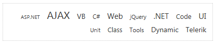

# Right-to-left Support


## 

The **RadTagCloud** fully supports right-to-left (RTL) language locales. The **RadTagCloud** is added to the page as child of the body element and in order to turn on the RTL support you should set **dir=rtl to the html or body** elements or to its direct parent.

````ASPNET
<div dir="rtl">
	<telerik:RadTagCloud RenderMode="Lightweight" ID="RadTagCloud1" runat="server" Width="400px">
		<Items>
			<telerik:RadTagCloudItem Text="ASP.NET" Weight="12" />
			<telerik:RadTagCloudItem Text="AJAX" Weight="134" />
			<telerik:RadTagCloudItem Text="VB" Weight="56" />
			<telerik:RadTagCloudItem Text="C#" Weight="38" />
			<telerik:RadTagCloudItem Text="Web" Weight="73" />
			<telerik:RadTagCloudItem Text="jQuery" Weight="23" />
			<telerik:RadTagCloudItem Text=".NET" Weight="78" />
			<telerik:RadTagCloudItem Text="Code" Weight="50" />
			<telerik:RadTagCloudItem Text="UI" Weight="80" />
			<telerik:RadTagCloudItem Text="Unit" Weight="20" />
			<telerik:RadTagCloudItem Text="Class" Weight="50" />
			<telerik:RadTagCloudItem Text="Tools" Weight="40" />
			<telerik:RadTagCloudItem Text="Dynamic" Weight="58" />
			<telerik:RadTagCloudItem Text="Telerik" Weight="60" />
		</Items>
	</telerik:RadTagCloud>
</div>
````



# See Also

 * [See this live in an online demo](https://demos.telerik.com/aspnet-ajax/tagcloud/examples/righttoleft/defaultcs.aspx)
