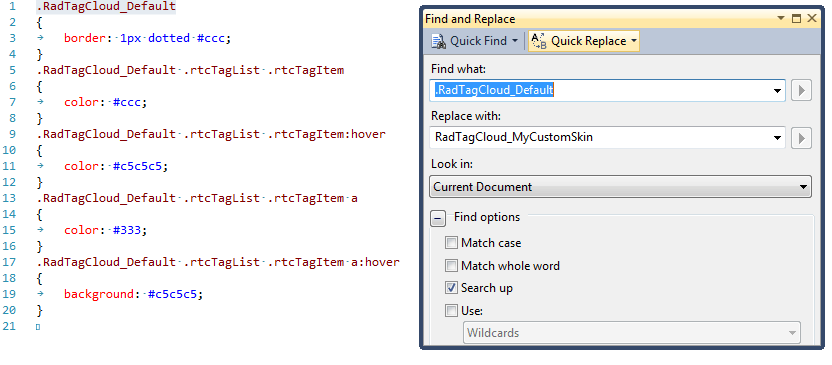

# Creating a Custom Skin


Each of the controls included in the Telerik UI for ASP.NET AJAX suite is styled with two CSS files that are loaded in a certain order. The first one - __ControlName.css__ (also called base stylesheet), contains CSS properties and values that are common for all skins, i.e it is layout-specific, not skin-specific. These are CSS float, padding, margin, font-size, font-family, etc. In the general case, when creating a custom skin for a control this file should not be edited, unless the custom skin needs different sizes, padding or margins.

The second file represents the actual skin of the control, and its name consists of the control name plus the skin name, i.e - __TagCloud.Default.css__. Upon creating a custom skin for the control, one should edit that particular file, as it contains skin-specific CSS properties, and references to images, colors, borders and backgrounds.

## Creating a Custom Skin for RadTagCloud for ASP.NET AJAX from an Existing One

In order to explain better the CSS classes of __RadTagCloud__, we will use both __TagCloud.css__ and __TagCloud.SkinName.css__ as external resources. We will modify an existing skin of __RadTagCloud__. Follow these steps to register an external skin for RadTagCloud for ASP.NET AJAX before editing any CSS:

1. In your project, create a new directory named __Skins__

1. In the skins folder create a new directory __MyCustomSkin__.

1. Go to __~/[TelerikControlsInstallationFolder]/Skins__ and copy __TagCloud.css__ in your __Skins__ folder

1. Go to __~/[TelerikControlsInstallationFolder]/Skins/Default__ and copy __TagCloud.Default.css__ in your Skins folder.

1. Rename __TagCloud.Default.css__ to __TagCloud.MyCustomSkin.css__ and the folder __Default__ to __MyCustomSkin__.

1. When you are finished you should have: __Skins/TagCloud.css__, __Skins/MyCustomSkin/__ and __TagCloud.MyCustomSkin__.

1. In order to support multiple skins of RadTagCloud on a single page, the wrapping skin-specific class is coined by the name of the control, __RadTagCloud__ plus underscore ("_") plus SkinName, i.e . __RadTagCloud _Default__, so in order to create a custom skin out of the Default skin, we should rename all occurrences of "Default" in TagCloud.MyCustomSkin.css to "MyCustomSkin" as shown below:
>caption 



1. Put a new server declaration of RadTagCloud on your page, and set __Skin="MyCustomSkin"__, __EnableEmbeddedSkins="false"__ and __EnableEmbeddedBasestylesheet="false"__:

````ASPNET
	    <telerik:RadTagCloud>
	        Id="RadTagCloud1" runat="server" Skin="MyCustomSkin" EnableEmbeddedSkins="false"
	        EnableEmbeddedBasestylesheet="false"</telerik:RadTagCloud>
````


1. Register __TagCloud.css__ and __TagCloud.MyCustomSkin.css__ in the <head>...</head> section of your web page. In order to have the CSS applied correctly, the base stylesheet should come first in the DOM:__Important:__Make sure the path to the files is correct, otherwise the skin will not apply.

````HTML
	    <link rel="stylesheet" type="text/css" href="Skins/TagCloud.css"></link>
	    <link rel="stylesheet" type="text/css" href="Skins/MyCustomSkin/TagCloud.MyCustomSkin.css">
	    </link>
````


1. Reload the page, and if the steps 1-9 have been followed correctly, you will see a __RadTagCloud__ running a custom __MyCustomSkin__ skin set as an external resource.


