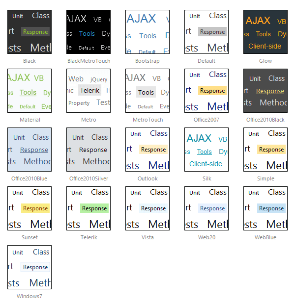

# Skins

## 

To make customizing the appearance of **RadTagCloud** as easy as possible, these control uses skins. A skin is a set of images and a CSS stylesheet that are applied to the HTML elements which make up the tagcloud control, defining the look and feel.

To apply a skin, set the Skin server-side property of the control. You can set it in the markup, by using the properties pane or the control's Smart Tag.

**RadTagCloud** is installed with a number of predefined skins:
>caption 

 

 @[template - Material skin is available only in Lightweight mode](/_templates/common/skins-notes.md#material-only-in-lightweight) 

