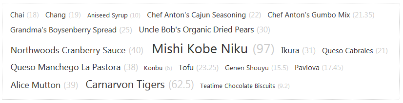

# Client-side Data Binding


This article introduces the client-side data binding feature of the **RadTagCloud** control.

## Getting Started with RadTagCloud’s Client-side Data Binding

You can data bind the tag cloud to various types of data sources to populate its items. You can use the **RadClientDataSource** control or call the **dataBind** method after the data source is specified via the **set_dataSource** method, shown in the tag cloud's [client-side API]().

You should define at least the **DataTextField** property of the tag cloud and, optionally, the rest of the properties that end with **Field** (you can check them in the [server-side API article]() of the control). These properties provide the field names from which the tag cloud takes the data for each item, as shown in **Example 1** and **Example 2**.

There are two events related to the client-side data binding:

* **OnClientItemDataBound** – gets or sets the name of the JavaScript function that will be called when an item is data bound on the client-side.

* **OnClientDataBound** – gets or sets the name of the JavaScript function that will be called when the tag cloud is data bound on the client-side.

You can find more information about the parameters the handlers of these events receive in the [client-side API article]().

## Simple Data Binding

You can pass an array of JSON literals to the **RadTagCloud** via its **set_dataSource(data)** client-side method and then call its **dataBind()** method. This is useful when you have already retrieved the desired data from a web service or from another appropriate source.You can see how to do this in **Example 1** and the result is shown in **Figure 1**. Note that the `Data<fieldname>Field` properties in the markup need to be set.
>caption Figure 1: Tag cloud that is data bound to a simple array.


**Example 1**: Data binding a tag cloud to an array of JSON literals on the client.

````ASP.NET
<script type="text/javascript">
	var datasource = [
		{ TextField: "ASP.NET", WeightField: 12 },
		{ TextField: "AJAX", WeightField: 134 },
		{ TextField: "VB", WeightField: 56 },
		{ TextField: "C#", WeightField: 38 },
		{ TextField: "Web", WeightField: 73 },
		{ TextField: "jQuery", WeightField: 23 },
		{ TextField: ".NET", WeightField: 78 },
		{ TextField: "Code", WeightField: 50 }
	];

	function OnClientLoad(sender, args) {
		sender.set_dataSource(datasource);
		sender.dataBind();
	}
</script>
<telerik:RadTagCloud RenderMode="Lightweight" ID="RadTagCloud1" runat="server" OnClientLoad="OnClientLoad" DataTextField="TextField" 
	DataWeightField="WeightField" RenderItemWeight="true" Width="50em">
</telerik:RadTagCloud>
````


## Using a RadClientDataSource Control for Data Binding

The **RadClientDataSource** control allows you to connect to a web service and fetch data that you can bind to any appropriate Telerik control. After configuring the client data source, all you need is to set its **ID** to the **ClientDataSourceID** property of the tag cloud control. You can see this approach in **Example 2** and the rendered result in **Figure 2**. Setting the required `Data<fieldname>Field` properties in the markup or in the code-behind is necessary for the operation to succeed.
>caption Figure 2: Tag cloud that is data bound to RadClientDataSource.



**Example 2**: Using RadClientDataSource control for data binding a RadTagCloud.

````ASP.NET
<telerik:RadTagCloud RenderMode="Lightweight" ID="RadTagCloud1" runat="server" ClientDataSourceID="tagsDataSource" DataTextField="ProductName" 
	DataWeightField="UnitPrice" RenderItemWeight="true" Width="50em">
</telerik:RadTagCloud>
<telerik:RadClientDataSource ID="TagsDataSource" runat="server">
	<DataSource>
		<WebServiceDataSourceSettings BaseUrl="http://demos.telerik.com/kendo-ui/service/">
			<Select Url="Products" DataType="JSONP" />
		</WebServiceDataSourceSettings>
	</DataSource>
	<Schema>
		<Model>
			<telerik:ClientDataSourceModelField FieldName="ProductID" DataType="Number" />
		</Model>
	</Schema>
	<FilterExpression>
		<telerik:ClientDataSourceFilterEntry FieldName="ProductID" Operator="LessThan" Value="20" />
	</FilterExpression>
</telerik:RadClientDataSource>
````


# See Also

 * [RadTagCloud client-side]()

 * [RadTagCloud server-side]()
 
 * [RadClientDataSource Overview]()
