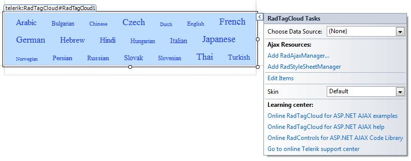
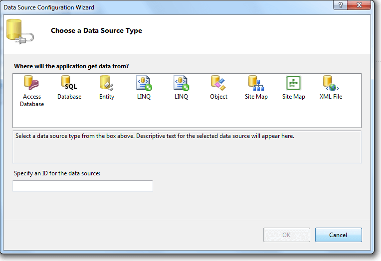
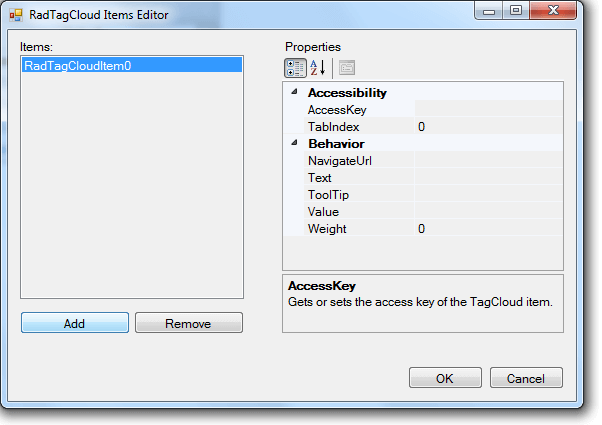

# Design Time

The Smart Tag of **RadTagCloud** lets you easily change the skin for your control or quickly get help. You can display the Smart Tag by right clicking on a **RadTagCloud** control and choosing "Show Smart Tag", or clicking the small rightward-pointing arrow located in the upper right corner of the control.
>caption 

## Choosing DataSource

The Smart Tag of the **RadTagCloud** begins with the datasource configuration. You can either choose an already existing declarative datasource controlfrom the list, or add a new one:

## Ajax Resources

* **Add RadAjaxManager...** adds a **RadAjaxManager** component to your Web page, and displays the **r.a.d.ajax Property Builder** where you can configure it.

* **Add RadStyleSheetManager** adds a **RadStyleSheetManager** to your Web page.

## Edit Items

The visual Item Editor offered by the **RadTagCloud** allows you to quickly and codelessly declare and setup the items in the**RadTagCloud**, as well as to set values for each item's properties - *TabIndex, NavigateUrl, Text, ToolTip, Value, Weight*:
>caption 

## Skin

The **Skin** drop-down displays a list of available [skins]() that you can apply to your control, along with an example of what the tool tips look like for each skin. Assign a skin by selecting from the list.

## Learning Center

* Links navigate you directly to examples, help, and code library.

* You can navigate directly to the [Telerik Support Center](http://www.telerik.com/support/home.aspx).

# See Also

 * [Skins]()
