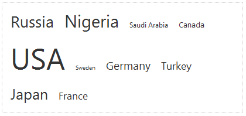
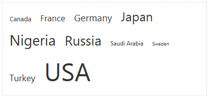

# Getting Started


## 

__Synopsis:__ The followingtutorial demonstrates how to set up a page with __RadTagCloud__ and manually populate the control with keywords. The walk-through will also show how to sort the items alphabetically in ascending order.

1. Add a RadTagCloud control in the default page of a new ASP.NET AJAX-enabled Web Application.
>caption 



1. In the Source view of the .aspx page, find the definition of the TagCloud, and add the __<Items></Items>__ inner property.

1. Add the following list of items between the opening and the closing tag of the <Items> property. Every item represents a country, with the Weight of the item equal representing the millions of people living there, and the NavigateUrl pointing to the country's Wikipedia article

````ASPNET
	    <telerik:RadTagCloud ID="RadTagCloud1" runat="server" Width="400px" MaxFontSize="50px">
	        <Items>
	            <telerik:RadTagCloudItem Text="Russia" Weight="141.9" NavigateUrl="http://en.wikipedia.org/wiki/Russia" />
	            <telerik:RadTagCloudItem Text="Nigeria" Weight="154.7" NavigateUrl="http://en.wikipedia.org/wiki/Nigeria" />
	            <telerik:RadTagCloudItem Text="Saudi Arabia" Weight="28.6" NavigateUrl="http://en.wikipedia.org/wiki/Saudi_Arabia" />
	            <telerik:RadTagCloudItem Text="Canada" Weight="34.1" NavigateUrl="http://en.wikipedia.org/wiki/Canada" />
	            <telerik:RadTagCloudItem Text="USA" Weight="309.4" NavigateUrl="http://en.wikipedia.org/wiki/USA" />
	            <telerik:RadTagCloudItem Text="Sweden" Weight="9.3" NavigateUrl="http://en.wikipedia.org/wiki/Sweden" />
	            <telerik:RadTagCloudItem Text="Germany" Weight="81.7" NavigateUrl="http://en.wikipedia.org/wiki/Germany" />
	            <telerik:RadTagCloudItem Text="Turkey" Weight="72.5" NavigateUrl="http://en.wikipedia.org/wiki/Turkey" />
	            <telerik:RadTagCloudItem Text="Japan" Weight="127.3" NavigateUrl="http://en.wikipedia.org/wiki/Japan" />
	            <telerik:RadTagCloudItem Text="France" Weight="65.4" NavigateUrl="http://en.wikipedia.org/wiki/France" />
	        </Items>
	    </telerik:RadTagCloud>
````


1. Set the following properties in the Properties Window of RadTagCloud __Width="400px"MaxFontSize="50px"Sorting="AlphabeticAsc"__

1. Press F5 to run the application. When a tag is clicked the browser navigates to the respective Wikipedia article.
>caption 


