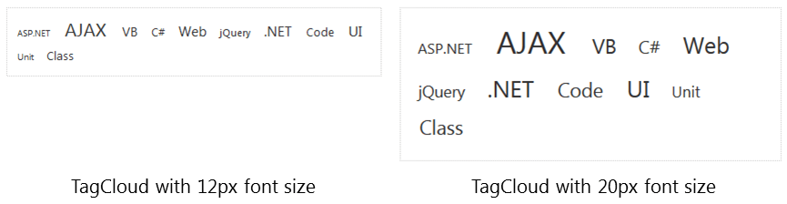

# Resposnive, Adaptive and Elastic Capabilities

This article explains the **elastic capabilities RadTagCloud offers**. The control supports **elastic design since Q2 2014**.

@[template](/_templates/common/render-mode.md#resp-elastic-desc)

>caption Figure 1: Comparison between appearances of a RadTagCloud with two different values for font size.



**RadTagCloud** supports changing the font size without breaking the control's appearance - if the new size is larger than the original, the elements of the tag cloud will simply increase their size as well to accommodate the text inside. This fluid layout is achieved by using **em** units for setting dimensions and paddings in the control, instead of **px** because **em** units are tied to the font size. This allows dimensions and sizes to scale with the font size.

>note If you configure the **MinFontSize** and **MaxFontSize** properties of **RadTagCloud** in pixels or without specifying a unit, the text in the tag cloud will not be scaled, because the font size of the items will be calculated in pixels. It is recommended to **set these properties in em units** to ensure that the whole control will be resized according to the chosen font size.
>


To use the elasticity of the RadTagCloud change the font size of the control's element (Example 2). As a result the sizing of the tags is proportionally changed (Figure 1).

@[template](/_templates/common/font-size-notes.md#note-and-example "control: RadTagCloud")

**Example 2**: The font size of **RadTagCloud** is set to 20px.

````ASPNET
<style type="text/css">
	div.RadTagCloud {
		font-size: 20px;
	}
</style>
<telerik:RadTagCloud ID="RadTagCloud1" runat="server" Width="400px">
	<Items>
		<telerik:RadTagCloudItem Text="ASP.NET" Weight="12"></telerik:RadTagCloudItem>
		<telerik:RadTagCloudItem Text="AJAX" Weight="134"></telerik:RadTagCloudItem>
		<telerik:RadTagCloudItem Text="VB" Weight="56"></telerik:RadTagCloudItem>
		<telerik:RadTagCloudItem Text="C#" Weight="38"></telerik:RadTagCloudItem>
		<telerik:RadTagCloudItem Text="Web" Weight="73"></telerik:RadTagCloudItem>
		<telerik:RadTagCloudItem Text="jQuery" Weight="23"></telerik:RadTagCloudItem>
		<telerik:RadTagCloudItem Text=".NET" Weight="78"></telerik:RadTagCloudItem>
		<telerik:RadTagCloudItem Text="Code" Weight="50"></telerik:RadTagCloudItem>
		<telerik:RadTagCloudItem Text="UI" Weight="80"></telerik:RadTagCloudItem>
		<telerik:RadTagCloudItem Text="Unit" Weight="20"></telerik:RadTagCloudItem>
		<telerik:RadTagCloudItem Text="Class" Weight="50"></telerik:RadTagCloudItem>
	</Items>
</telerik:RadTagCloud>
````


# See Also

 * [RadTagCloud Server-Side]()

 * [RadTagCloud Getting Started]()

@[template](/_templates/common/font-size-notes.md#related-resources)