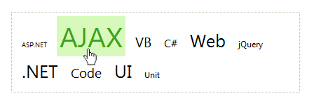

# TagCloud Overview

**Telerik RadTagCloud** is a flexible UI component for categorization and weighted visualization of user-generated tags or related keywords. The user can easily customize the appearance of the control, choose the items that will appear in the cloud, sort the tags alphabetically or by weight, in ascending or descending order, and use various other configuration options.
>caption 

## Key features:

* **Distribution** - specifies how the font size will be distributed among the items. When set to Linear the font size is distributed linearly and in the case of Logarithmic the items are weighted logarithmically.

* **Sorting**- specifies in what order the TagCloud items will be listed. By default they are not sorted. The user can choose to sort them alphabetically or based on their weight, in ascending or descending oreder. Possible values for this property are: NotSorted (default), AlphabeticAsc, AlphabeticDsc, WeightedAsc and WeightedDsc.

* **Filtering Of The Items** - Three properties control the filtering of the items: MinimalWeightAllowed, MaxNumberOfItems and TakeTopWeightedItems.

* **MinimalWeightAllowed** - specifies the lower bound for the item Weight. If the Weight of the item is smaller than this bound, the tag will not appear in the cloud. The default value is 0.0, which means the items will not be filtered.

* **MaxNumberOfItems**- specifies the maximal number of items that can (will) be shown in the cloud. If the TakeTopWeightedItems property is set to true, the items with the highest weight will be taken. The defualt value is 0, which means the items will not be filtered.

* **MinFontSize**and **MaxFontSize**- specify the range of the font size, the TagCloud items could have. The defualt values are 10px and 20px, respectively. These properties accept values of type System.Web.UI.WebControls.Unit and the font-size of the TagCloud items will have the same System.Web.UI.WebControls.UnitType as the one of the properties. The value of MaxFontSize must be greater or equal than the one of MinFontSize.
