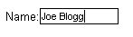
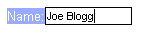

# Adding Labels


##

It is easy to attach a label to an **RadInput** control: simply set the text of the label as the value of the **Label** property. The label automatically appears to the left of the input area:



The look of the label text is determined by the **[Skin]()** property of the **RadInput** control. When you set the Skin property, the **LabelCssClass** property is automatically set to "riLabel". This value is the CSS style that the skin applies to the label. You can substitute your own CSS class to change the appearance of the label by setting the **LabelCssClass** property.

This is shown in the following example:

````ASPNET
<head runat="server">
	<title>Untitled Page</title>
	<style type="text/css">
		label.MyLabelStyle.riLabel
		{
			background: #99aaff;
			color: white;
		}
	</style>
</head>
<body>
	<form id="form1" runat="server">
	<asp:ScriptManager ID="ScriptManager1" runat="server" />
	<div>
		<telerik:RadTextBox ID="RadTextBox1" runat="server" Label="Name:" LabelCssClass="MyLabelStyle">
		</telerik:RadTextBox>
	</div>
	</form>
</body>
````


>note Note the **label.MyLabelStyle.riLabel** selector in the CSS class definition. It makes the rule have higher priority and take precedence over the definitions included with the skin.
>


The above declaration results in the following appearance:



# See Also

 * [Structure]()
