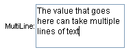
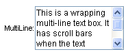
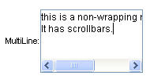
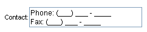

# Multi-Line Text Boxes


## 

You can create multi-line **RadTextBox** and **RadMaskedTextBox** controls by setting the **TextMode** property to "MultiLine". When the **TextMode** property is "MultiLine", the text box displays its value using multiple lines.

The **Columns** property determines the width of each line in characters, and the **Rows** property determines the number of lines the text box displays. The **Wrap** property determines how the value in the text box is displayed within the area defined by the **Columns** and **Rows** properties:

* If the **Wrap** property is **True**, the value in the text box extends to the limit set by the **Columns** property, and then wraps to additional rows as necessary:

If the value in the text box extends beyond the number of rows specified by the **Rows** property, the text box gets a vertical scroll bar:


* If the **Wrap** property is **False**, the value in the text box does not wrap. Additional lines are used only if the text value includes a new-line character. A horizontal scroll bar appears if the value of any line exceeds the limit set by the **Columns** property:


When working with a multi-line **RadMaskedTextBox** control, you can enter the carriage-return line feed characters as literal parts of the mask to format the layout of the value:


````ASPNET
<telerik:RadMaskedTextBox ID="RadMaskedTextBox1" runat="server" Skin="Office2007"
	Label="Contact:" TextMode="MultiLine" Mask="Phone: (###) ### - ####\r\nF\ax: (###) ### - ####"
	Rows="2" Columns="25">
</telerik:RadMaskedTextBox>
````


# See Also

 * [RadTextBox Overview]()

 * [RadMaskedTextBox Overview]()
