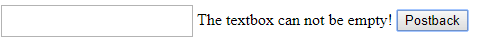

# Validation


## Validating entered values

The **RadTextBox** control support ASP.NET validators (both client and server side). For example a **RequiredFieldValidator** can be used to make sure the user does not skip mandatory fields. A **RangeValidator** can be applied to ensure the entered value falls within some specified interval.


To use ASP.NET validators with **RadInput** controls, simply set the ID of the **RadInput** control as the value of the **ControlToValidate** property of the validator.

Since Q2 2012 there are some modifications for RadInput validation.The main idea is to render only the input element all the time, and remove the span element and the excessive inputs. To be achieved this the validation value is stored in [“expando”](http://msdn.microsoft.com/en-us/library/89t1khd2%28v=vs.94%29.aspx) property and we submit real value through the client state. Also, the [ValidatorGetValue](http://msdn.microsoft.com/en-us/library/aa338815%28v=vs.71%29.aspx) function of the [asp:Validators](http://msdn.microsoft.com/en-us/library/debza5t0.aspx) was overriden to look our expando property called “RadInputValidationValue”.

## Example



The following declaration shows the use of a required field validator from the form above:

````ASPX
<telerik:RadTextBox
	ID="RadTextBox1"
	runat="server"
	RenderMode="Lightweight">
</telerik:RadTextBox>
<asp:RequiredFieldValidator
	ID="TextBoxRequiredFieldValidator"
	runat="server"
	Display="Dynamic"
	ControlToValidate="RadTextBox1"
	ErrorMessage="The textbox can not be empty!">
</asp:RequiredFieldValidator>
<asp:Button Text="Postback" ID="btn1" runat="server" />
````


For a live example of the form shown above, see the [Validation demo](http://demos.telerik.com/aspnet-ajax/input/examples/common/validation/defaultcs.aspx).

## Triggering validation

If the validators are set to use client-side validation (their **EnableClientScript** property is **True**), the **RadInput** controls automatically trigger the validator that checks their value when the user finishes editing. That is, when the user has changed the value in the control and it then loses focus, the validator checks the new value of the input control.

You can also use the RadInput controls to trigger the validation of other controls on the page. To make a **RadInput** control trigger other validators when it causes a postback:

* Set the **AutoPostBack** property to **True**. When **AutoPostBack** is **True**, the input control causes a postback when the user changes its value and it then loses focus.

* Set the **CausesValidation** property to **True**. This causes the postback that the **RadInput** control initiates to trigger the validators on the Web page (not just the validator that is checking the value of the RadInput control.)

By default, all validators on the Web page must be successful before the postback that the input control initiates can occur. You can prevent some controls from being validated on the postback while requiring other controls on the Web page to be validated. This is accomplished by using **Validation Groups**.

The validator controls have a **ValidationGroup** property. The **RadInput** controls also have a **ValidationGroup** property. When the input control causes a postback and triggers the validators on the page, itonly causes validation by those validators whose **ValidationGroup** property matches the **ValidationGroup** property of the input control. (The reason the default behavior is for all validators to executeon postback is because the default value of the **ValidationGroup** property on both the input control and the validatorsis an empty string.)


## See Also

* [Display ErrorMessage inside RadInput](https://www.telerik.com/support/kb/aspnet-ajax/textbox/details/how-to-display-errormessage-inside-radtextbox)

