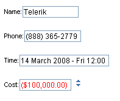

# Getting Started Overview

## 

This tutorial will walk you through creating a Web page that uses **RadTextBox** controls. It shows how to:

* Use the RadTextBox control.

* Apply a **Skin** to customize the look and feel.

* Add labels to the input controls.

* Add messages to appear when nothing is entered.

* Customize the selection behavior when the control receives focus.

* Specify formats for display and editing.

1. Drag a **RadTextBox** control from the toolbox onto your Web page. It's [Smart Tag]() should appear automatically.

2. In the **RadTextBox** Smart Tag,
	* Set the **Empty Message** to "-Enter a username-". This message will appear in the text box when the user has not entered any text.
	* Open the **Skin** drop-down. It lets you preview the available skins and choose a skin to give the text box its general look-and-feel. Choose "Office2007".
	
	
3. In the designer, right-click the **RadTextBox** control and choose **Properties** from its context menu:

4. In the properties pane for the **RadTextBox** control, set the **Label** property to "Username:". Note that a label automatically appears in the **RadTextbox** control.

5. In the **Behavior** section of the properties pane, locate the **SelectionOnFocus** property and change it to "SelectAll". This causes the entire text in the text box to become selected when focus moves to the text box so that it is replaced when the user starts typing. Other options move the caret to the beginning or end of the text box.

6 Run the application. The string you entered for the **EmptyMessage** properties appear in the input controls, because they do not have any values entered. The labels all appear next to the input area. On the **RadNumericTextBox** control, the spin buttons appear next to the input area:

7 Experiment with entering data in the controls:

