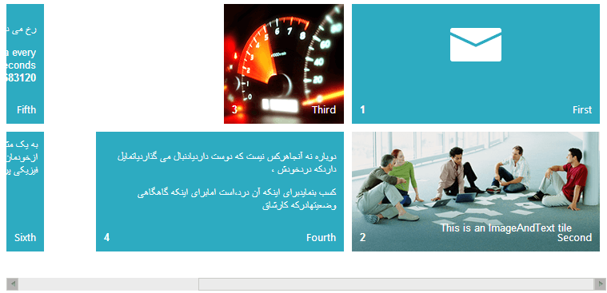

# Right-to-Left Support


**RadTileList** offers Right-to-Left (RTL) support. It is enabled automatically when	you place a **RadTileList** control in a containerwith its `dir` property (or its CSS `direction` property) set to `rtl`.

When in RTL mode, the **RadTileList** reverses the tiles order, i.e., the first tile is on the top right-hand side instead ofon the top left-hand side. The direction rule applies to all its child elements, so tiles will also have their texts in RTL mode automatically.

**RadTileList** uses the **rtlistRtl** CSS class to apply the needed changesso you can use it to cascade and apply any customizations you need. The **rtileRtl** class is applied to individual tiles in RTL mode.

**Example 1** shows a simple declaration that will put the **RadTileList** in RTL mode (**Figure 1**).
>caption Figure1: RadTileList in RTL mode.



**Example 1: RadTileList in RTL mode.**

````ASP.NET
<div style="direction: rtl; width: 750px;">
	<telerik:RadTileList runat="server" ID="RadTileList1" TileRows="2" SelectionMode="Single" EnableDragAndDrop="true">
		<Groups>
			<telerik:TileGroup>
				<telerik:RadIconTile ImageUrl="../../Img/Tiles/IconTile.png" Shape="Wide">
					<Title Text="First"></Title>
					<Badge Value="1" />
				</telerik:RadIconTile>
				<telerik:RadImageAndTextTile Text="This is an ImageAndText tile" Shape="Wide" ImageUrl="../../Img/Wide/img_documentation.png">
					<Title Text="Second"></Title>
					<Badge Value="2" />
				</telerik:RadImageAndTextTile>
				<telerik:RadImageTile ImageUrl="../../Img/Square/img_gauge.png">
					<Title Text="Third"></Title>
					<Badge Value="3" />
				</telerik:RadImageTile>
				<telerik:RadContentTemplateTile Shape="Wide">
					<ContentTemplate>
						<div style="padding: 10px;">
							<p>دوباره نه آنجاهرکس نیست که دوست داردیادنبال می گذاردیاتمایل داردکه دردخودش ،</p>
							<p>کسب بنمایدبرای اینکه آن درد،است امابرای اینکه گاهگاهی وضعیتهادرکه کارشاق</p>
						</div>
					</ContentTemplate>
					<Title Text="Fourth"></Title>
					<Badge Value="4" />
				</telerik:RadContentTemplateTile>
			</telerik:TileGroup>
			<telerik:TileGroup>
				<telerik:RadLiveTile Shape="Wide" UpdateInterval="10000">
					<WebServiceSettings Method="GetRandomData" Path="DefaultCS.aspx" />
					<ClientTemplate>
						<div style="padding: 10px;">
							<p>رخ می دهندودردمی توانداورامقداری کمال مسرت بدست بیاورد</p>
							This is a Live tile. It will fetch random data
							every 10 seconds. <br />
							The last request returned: <strong>#=data#</strong>.
						</div>
					</ClientTemplate>
					<Title Text="Fifth"></Title>
					<Badge Value="5" />
				</telerik:RadLiveTile>
				<telerik:RadTextTile Text="به یک مثال جزیی ،می گیردکه ازخودمان تابه حال تمرین فیزیکی پرزحمت ،بجز">
					<Title Text="Sixth"></Title>
					<Badge Value="6" />
				</telerik:RadTextTile>
			</telerik:TileGroup>
		</Groups>
	</telerik:RadTileList>
</div>

````


````C#
[WebMethod]
public static int GetRandomData()
{
	Random rnd = new Random();
	return rnd.Next();
}
````
````VB
<WebMethod()> _
Public Shared Function GetRandomData() As Integer
	Dim rnd As Random = New Random()
	Return rnd.Next()
End Function
````


